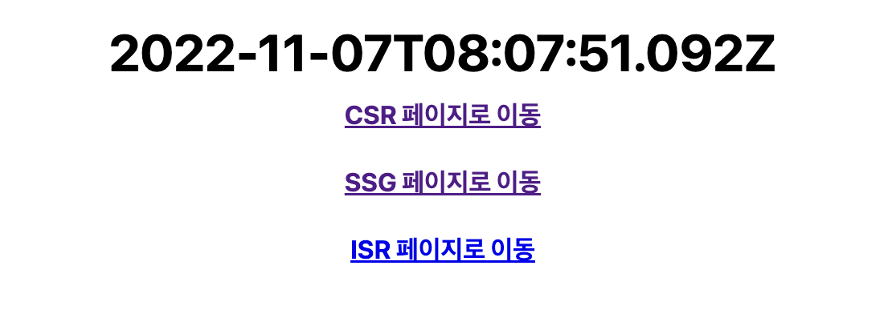

# Part1 Next.js 개념 소개

- 실습 환경

  > next12.1.6 버전을 베이스로 한 강의로 'npm install next@12.1.6'를 이용해서 하위 버전으로 프로젝트를 진행하였다.

  > 'npm install -g yarn': 패키지 매니저로 yarn을 설치했다.(-g: 글로벌 옵션)

  > 'yarn set version <수정할 버전>' 명령으로 강의 당시 버전인 1.22.17로 변경하여 진행했다. 'yarn --version' 명령으로 현재 버전을 확인할 수 있다.

  > VSCode Extension으로 React Snippets를 추가적으로 설치하였다.

---

## **01 Next.js 소개**

> [공식 문서](https://nextjs.org): Vercel에서 관리하는 Next.js 프레임워크에 대한 공식 홈페이지

간단한 소개로 다음과 같은 특징을 내세우고 있다. hybrid static & server rendering, TypeScript support, smart bundling, route pre-fetching, and more.

React는 자바스크립트 라이브러리를 표방하고 있는데, Next.js와 어떤 차이가 있는지를 알면 Next.js가 어떤 도구인지 이해하는 데 도움이 된다.

### 프레임워크 vs 라이브러리

- 프레임워크는 '기반구조' vs 라이브러리는 '개발 편의 도구'들

- 제어 주도권은 프레임워크가 갖는다 vs (라이브러리에서) 제어 주도권은 사용자가 갖는다

- 프레임워크는 '기계'(굴삭기) vs 라이브러리는 '공구'(니퍼)

- 프레임워크의 자유도는 작다 vs 라이브러리의 자유도는 상대적으로 크다

프레임워크는 특정 디자인 패턴이나 동작과 기능을 위한 정의나 방식을 먼저 정리해 두었다. 따라서 정해진 틀에 맞춰 협업하며 통일성을 갖출 수 있다.

### Next.js를 사용하는 이유

- 규모 있는 서비스 구조 설계를 위한 이점이 있다.

- 개발 환경 편의성 / 코드 분할을 처리해 줌 / 파일 기반 구조 등의 기능을 제공한다.

- SEO(검색 엔진 최적화): 사용자들이 서비스를 찾기 편리하게 된다.

- 간단한 API 구성에 용이하다.

- 편리한 Vercel 배포 시스템을 이용 가능

비슷한 React 프레임워크 대체제로는 Gatsby / Remix 등이 있다.

---

# Part2 Next.js 시작하기

## **01 프레임워크 구조**

### learn-starter 프로젝트 살피기

```
npx create-next-app nextjs-blog --use-npm --example "https://github.com/vercel/next-learn/tree/master/basics/learn-starter"
```

디렉터리에서 터미널에 위와 같은 명령을 입력하면, Next.js에서 제공하는 learn-starter 프로젝트가 nextjs-blog 디렉터리에 설치된다.

아래는 package.json 파일 전문이다. Next.js 설치 시 package.json에는 scripts가 추가되게 된다.

```json
{
  "private": true,
  "scripts": {
    "dev": "next dev",
    "build": "next build",
    "start": "next start"
  },
  "dependencies": {
    "next": "latest",
    "react": "18.2.0",
    "react-dom": "18.2.0"
  }
}
```

이때 scripts 내부 요소 각각은 다음과 같은 의미를 갖는다.

- "dev": "next dev" - **개발 모드**에서 Next.js 를 시작하는 실행

- "build": "next build" - **프로덕션 용도**로 애플리케이션을 빌드하는 실행

- "start": "next start" - Next.js **프로덕션 서버**를 시작하는 실행

'npm run dev'를 터미널에 입력하면 나오는 주소(http://localhost:포트)로 프로젝트가 실행된 것을 확인할 수 있다.


터미널에서 [nextjs-blog] 디렉터리로 이동 후, 패키지 매니징을 yarn으로 하기 위해 'yarn'을 입력해 준다. 성공적으로 진행되면 yarn.lock 파일이 생성된다.

'npm run dev'와 마찬가지로 'yarn dev' 명령어로 프로젝트를 실행할 수 있다. (종료는 control + c)


아래는 실행 화면이다.


[pages] 디렉터리에 있는 index.js 파일을 수정해서 저장 시 반영되는 것을 볼 수 있다. [public] 디렉터리에 넣어둔 svg 파일은 'img src="/vercel.svg'처럼 바로 접근할 수 있다.

### commerce 프로젝트 살피기

[commerce 프로젝트 깃허브](https://github.com/vercel/commerce/tree/8398a962154a972d3af308ec48e01bebe5b92f7a): git clone 명령어를 이용하여 프로젝트를 복제한다. 7월 13일 기준 버전으로 선택했다.(이후 버전은 pnpm을 packageManager로 사용하므로 강의와 일치하지 않는다.) 클론한 디렉터리 [commerce]로 이동 후 git log로 커밋 로그를 확인한 뒤 특정 버전으로 롤백했다.

```
$ git clone https://github.com/vercel/commerce.git

$ git reset --hard 87134e2990c3ce666ec364d9c8714c0b252e8792
```

터미널에서 code commerce를 입력하면 VSCode가 추천 확장 기능을 표시한다.(extension.json 파일이 포함되어 있기 때문이다.) 이들을 설치하고, 터미널에서 yarn을 입력한다.

```json
{
  "name": "commerce",
  "license": "MIT",
  "private": true,
  "workspaces": ["site", "packages/*"],
  "scripts": {
    "build": "turbo run build --filter=next-commerce...",
    "dev": "turbo run dev",
    "start": "turbo run start",
    "types": "turbo run types",
    "prettier-fix": "prettier --write ."
  },
  "devDependencies": {
    "husky": "^7.0.4",
    "prettier": "^2.5.1",
    "turbo": "^1.2.16"
  },
  "husky": {
    "hooks": {
      "pre-commit": "turbo run lint"
    }
  },
  "packageManager": "yarn@1.22.17"
}
```

packages.json 파일을 보면 learn-starter 프로젝트와 모양이 꽤 다른 것을 알 수 있다.

프로젝트의 [site] 폴더가 learn-starter 프로젝트와 유사한 구조를 가지고 있는데, turbo가 이를 감싸주는 무언가로 이해하면 된다.

아래 명령을 통해 yarn build 입력 시 제시되는 오류 'The engine "node" is incompatible with this module. Expected version "12 - 16". Got "18.9.0"'를 무시했다.

```
yarn install --ignore-engines
```

yarn build을 입력하고 정상적으로 마무리가 되면 yarn start를 입력한다. http://localhost:3000로 마찬가지로 접속했을 때, commerce 프로젝트가 제대로 실행되는 것을 볼 수 있다.


build를 거쳤기 때문에 dev 명령으로도 동작한다. dev로 실행 시 [pages] 디렉터리의 index.tsx 파일을 수정해서 저장 시 메인 화면에 반영되는 모습을 확인할 수 있다.(start 명령어로 실행했다면 다시 build하고 start를 거쳐야 반영된다.)

처음 보라색 배경의 티셔츠 항목을 누르면 다른 화면으로 넘어간다.


주소를 보면 'http://localhost:3000/product/new-short-sleeve-t-shirt'로 나타난다. 프로젝트의 [pages] - [product] 디렉터리를 보면 [slug].tsx가 있다. 마찬가지로 이 파일이 현재 페이지를 구성하고 있는 것이다.([slug]는 여러 값을 받아도 와일드카드처럼 동작하게 된다.)

수정 사항을 반영하고 yarn build, yarn start로 실행하고, 개발자 도구를 키고 새로고침 시 네트워크 요청이 가는 것을 볼 수 있다.


예시로 lightweight-jacket.json을 보자


코드를 보면 API 요청을 했고 가져온 image 이름까지 보이는 것이 확인된다.

---

## **02 Data Fetching**

말 그대로 Data Fetching는 '데이터 가져오기'를 의미한다. 화면을 구성하려면 결국 어디선가 Data를 가져와야 하기 때문에 필수적인 작업이다. Next.js가 제시하는 Data Fetching 방법은 3+1 가지가 있다.(SSR, CSR, SSG, ISR)

기존 learn-starter 프로젝트 예제를 살피며 확인할 것이다.([pages] 디렉터리 내 index.js 파일) 반영 여부를 파악하기 쉽게 \<main\> \</main\> 내부를 \<h1 ...\> \</h1\> 태그만 남기고 모두 삭제했다.

```JavaScript
      <main>
        <h1 className="title">
          Welcome to <a href="https://nextjs.org">Next.js!!</a>
        </h1>
      </main>
```

yarn dev로 실행 시 다음과 같이 화면이 출력된다.


이제 Data Fetching 방법을 차례로 살펴 보자.

1. **SSR(Server Side Render)**: 서버 사이드에서 렌더링한다. 즉, 서버가 데이터를 가져와서 화면을 그린다는 뜻이다. SSR을 담당하는 함수는 getServerSideProps()이다.

따라서 예제에서 import를 제외한 제일 상단에 getServerSideProps() 함수를 생성했다. 이 함수는 props라는 것을 return해야 하며, 예제에서는 time으로 지정했다.

```JavaScript
export async function getServerSideProps() {
  return {
    props: { time: new Date().toISOString() }
  }
}
```

또한 위에서 반환하는 time이 표시될 수 있도록 매개변수와 \<h1\> 태그 내부에 {time} 코드를 추가했다.

```JavaScript
export default function Home({ time }) {
  // ...

      <main>
        <h1 className="title">
          {time}
        </h1>
      </main>
```

새로고침 시 서버에서 전달한 시간이 출력되며 계속 업데이트된다.(새로고침 때마다 서버에서 계속 데이터를 fetching 한다.)


그렇다면 getServerSideProps() 함수 내부에 console.log()를 넣으면 서버와 클라이언트 과연 어느쪽의 콘솔에 로그가 출력될까? 함수에 console.log('server') 문장을 추가하고 새로고침하였다.

```JavaScript
export async function getServerSideProps() {
  console.log('server')

  return {
    props: { time: new Date().toISOString() },
  };
}
```

아래 두 사진이 결과를 나타낸다. 서버 콘솔에만 server라는 문자열이 출력됐다.


<br/>

2. **CSR(Client Side Render)**: 클라이언트 사이드에서 렌더링한다. 즉, 사용자의 브라우저 측에서 데이터를 가져와서 화면을 그린다는 뜻이다. CSR을 담당하는 함수는 따로 없다. 기존 React에서 사용하던 방법과 동일하다.

SSR 예제는 서버에서 시간 데이터를 Fetching했다면, 이번에는 클라이언트 측에서 시간 데이터를 Fetching하도록 설계해 보자.

우선 \<h1\> 태그 아래 CSR을 구현할 페이지의 하이퍼링크가 담긴 문장을 넣는다. Link를 사용하기 위해 문서 최상단에 import Link from 'next/link' 문장을 추가한다.

```JavaScript
import Link from "next/link";
//...
      <main>
        <h1 className="title">{time}</h1>
        <h1>
          <Link href="/csr"> CSR 페이지로 이동 </Link>    // 강의에서 쓴 \<a\>는 Link와 a 사이에 공백이 존재하면, 공백이 자식 노드로 간주되는 바람에 오류가 발생한다.
        </h1>
      </main>
```

이제 연결될 페이지를 제작한다. [pages] 디렉터리 안에 csr.js를 추가했다. 사용하지 않을 SSR 함수와 하이퍼링크를 빼고, index.js의 코드를 복사한 뒤 붙여넣은 뒤 export default function CSR()로 수정했다.


이제 클라이언트에게 시간을 받는 CSR 파트를 만든다. 아래는 csr.js 파일 코드에 추가한 부분이다.

```JavaScript
import { useEffect, useState } from "react";
//...

export default function CSR() {
  const [time, setTime] = useState();

  useEffect(() => {
    setTime(new Date().toISOString());
  }, []);
```

클라이언트에게 시간을 받아서 표시하는 화면이 도출된다.


만약 다음과 같은 문장을 추가하면 어떻게 될까?

```JavaScript
// csr.js
  useEffect(() => {
    console.log("client");
    setTime(new Date().toISOString());
  }, []);
```

이 경우 새로고침을 하면 클라이언트(브라우저) 콘솔에 client 문자열이 출력된다.


<br/>

3. **SSG(Static-Site Generator)**: 정적 사이트를 생성한다. 여기서 생성한다는 건 데이터를 가져와서 만든다는 의미로, 즉 정적 사이트를 데이터를 가져와서 그린다는 뜻이다. SSG를 담당하는 함수는 getStaticProps()(+ getStaticPaths())이다.

정적 페이지는 build를 하는 그 순간 고정되는 '정적' 페이지가 만들어진다.(dev 환경에서는 SSR처럼 동작해서 의도와 다르게 된다.) 덕분에 얼마나 새로고침을 하든, 누가 아무리 와도 build 당시의 페이지를 보여주면 되기 때문에 서버에 부하가 생기지 않는다.

예를 들어, 블로그에서 글을 작성하면 수정을 시도하기 전까지는 build 당시 페이지를 보여주면 서버 부하를 줄이고 자원을 아낄 수 있다. 이 장점 때문에 SSG가 SSR보다 권장된다.

SSG의 동작을 살펴보기 위해 [page] 디렉터리에 ssg.js를 새로 만들었다.(베이스는 csr.js을 복사했음) index.js에서 Link를 통해 이동할 수 있다.(팁: index.js에서 링크를 만들 때 option + shift + 아래 방향키로 코드 한 줄을 복사했다.)

```JavaScript
// index.js
        <h1><Link href="/csr"> CSR 페이지로 이동 </Link></h1>
        <h1><Link href="/ssg"> SSG 페이지로 이동 </Link></h1>
```

ssg.js 코드 상단에 SSG 생성을 위해 getStaticProps() 함수를 추가했다.

```JavaScript
import Head from "next/head";

export async function getStaticProps() {
    console.log("server");

    return {
      props: { time: new Date().toISOString() },
    };
  }

export default function SSG({time}) {
  return (
```

yarn build - yarn start로 결과를 확인했다.


SSG로 가서 아무리 새로고침을 해도 빌드 당시 시간이 표시됐다.


console.log("server"); 문장은 build를 할 때만 출력되었고, 클라이언트에서 아무리 새로고침해도 더 이상 뜨지 않았다.


이전에 확인한 commerce 프로젝트에서도 SSG을 쓴 흔적을 발견할 수 있다. commerce 프로젝트의 [site] - [pages] - [product] - [slug].tsx 코드를 살펴 보자. yarn dev로 실행했다.(한 차례 build start 과정을 거치고 다시 진행했다.)

```TypeScript
// [slug].tsx
export async function getStaticProps({
  //...
})

export async function getStaticPaths({ locales }: GetStaticPathsContext) {
  const { products } = await commerce.getAllProductPaths()
  // console.log(JSON.stringify(products)) 문장 추가
  //...
```

getStaticPaths() 함수가 보이는데, 이는 [slug].tsx가 와일드카드처럼 쓰이면서 미리 그려놔야 하는 path가 무엇인지 알려주는 역할을 한다. 동작을 확인하기 위해 'console.log(JSON.stringify(products))' 문장을 써서 로그를 남기도록 했다.

제품을 하나 클릭하자 서버 콘솔에 문장이 출력됐다.

```
[{"path":"/new-short-sleeve-t-shirt"},{"path":"/lightweight-jacket"},{"path":"/shirt"}]
```

이 세 가지 path를 getStaticPaths() 함수로 미리 만들어 두는 것이다.


<br/>

4. **ISR(Incremental Static Regeneration)**: 증분 정적 사이트를 재생성한다. 이 말은 (특정 주기로) 데이터를 가져와서 정적 사이트를 다시 그린다는 뜻이다. ISR을 담당하는 함수는 getStaticProps()로 SSG와 동일하지만, 별개로 revalidate라는 값을 리턴해야 한다.

예를 들어 상품을 주기적으로 업데이트하는 쇼핑몰 같은 경우, ISR을 쓰면 SSR과 SSG의 장점을 모두 취할 수 있다.

ISR 동작을 확인하기 위해 다시 learn-starter 프로젝트를 살피자. index.js에 ISR 링크를 추가하고, ssg를 복사하여 새로 isr.js를 만들었다. getStaticProps() 함수에 revalidate 값을 리턴하도록 코드를 추가해서 ISR로 만들었다.

```JavaScript
// index.js
        <h1><Link href="/isr"> ISR 페이지로 이동 </Link></h1>
```

```JavaScript
// isr.js

```

정적 사이트이므로 yarn build - yarn start로 결과를 확인했다.



새로고침을 하면 시간이 바뀐 정적 페이지가 다시 생성된 것을 확인할 수 있었다. 서버에도 다시 구성이 되면서 콘솔에 server라는 문장을 남겼다.


여기서 반환한 revalidate: 1란 1초마다 데이터를 fetching해서 다시 정적 페이지를 build한다는 뜻이다.

---

## **03 Layouts - Pages - Images**

이전 예제에서 본 페이지들을 기억해 보자. 코드가 다음과 같이 url로 1:1(혹은 1:n) 매칭이 되었다.

- pages/index.js => /

- pages/ssg.js => /ssg

- pages/products/[slug].js => /products/\* (js, jsx, ts, tsx)

### Pre-renders와 SEO(검색 엔진 최적화)


Next.js는 모든 페이지를 기본적으로 pre-render한다. 처음 클라이언트에서 html을 로드할 떄 이미 많은 부분이 load되고, JS가 load되면서 Hydration 과정을 거쳐 사용자와 App이 상호작용할 수 있게 된다.(반면 Pre-render 과정이 없으면, JS load를 거치기 전까지는 아무 것도 표시되지 않는다.)

No Pre-render인 경우 자바스크립트가 동작하지 않는, 해석할 수 없는 엔진이라면, 내부가 무엇인지 알지 못한다. 따라서 검색 엔진에게 데이터를 제공하지 못하는 단점이 생긴다.

Next.js의 SSG는 빌드 타임에 pre-render가 이루어지고(recommended), SSR은 요청 타임에 pre-render가 이루어진다. 부하가 덜 발생하는 SSG도 2가지 상황으로 나뉜다.

- Page 내용물이 외부 데이터에 의존적인 상황 => getStaticProps만 이용

- Page Paths까지 외부 데이터에 의존적인 상황 => getStaticPaths까지 활용해야 한다.

### Layout

Layout을 이용하면 여러 Page를 공통으로 처리할 수 있다. learn-starter 프로젝트에 레이아웃을 구성해 보자. index.js, csr.js, ssg.js, isr.js 등은 모두 공통되는 코드가 많았다. 프로그래밍에서 어떤 공통된 부분을 모듈화해서 중복 코드를 줄이듯이 레이아웃을 만들 수 있다.

프로젝트 안에 [components] 폴더를 만들었다. 내부에 layout.js 파일을 만들었다. index.js의 대부분의 코드를 복사해서 구성했다.

layout.js는 컴포넌트이기 때문에(페이지가 아니기 때문에) getServerSideProps() 같은 server side 렌더링을 할 수 없다. \<main\> 태그 내 코드들은 페이지에서 구성할 것이기 때문에 삭제하고, children을 반환하게 설계했다.

```JavaScript
// layout.js
import Head from "next/head";

export default function Layout({ children }) {
  return (
    <div className="container">
      <Head>
        <title>Create Next App</title>
        <link rel="icon" href="/favicon.ico" />
      </Head>

      <main>
        {children}
      </main>

    //... 나머지는 동일
)}
```

레이아웃 컴포넌트 구성이 끝났으면 [pages] 디렉터리 내부에 \_app.js를 만든다.(Next.js에서 제공하는 API 형식을 따라갈 것이다.)

> \_app은 \_document와 함께 페이지에 공통적으로 적용될 내용이 들어가는 중요한 기본 페이지 중 하나다. 서버에 요청이 들어오면 **가장 먼저 실행되는 컴포넌트**로, 공통 레이아웃 역할을 한다. 함수는 다음과 같은 속성값을 가진다.

- Component: 서버에 요청한 페이지. 예를 들어 http://localhost:3000/home에 접속했다면, Component는 home 컴포넌트를 가리킨다.

- pageProps: getInitialProps, getStaticProps, getServerSideProps 중 하나를 통해 페칭한 초기 속성값이 된다.(getInitialProps를 하면 자동 정적 최적화가 비활성화되어 모든 페이지가 서버 사이드 렌더링을 통해 제공되게 된다.)

```JavaScript
// _app.js
import Layout from "../components/layout";

export default function App({ Component, pageProps }) {
  return (
    <Layout>
      <Component {...pageProps} />
    </Layout>
  );
}
```

실행한 결과 다음과 같이 footer가 두 개로 늘어난 것을 확인할 수 있었다.


이렇게 중복되지 않도록 index.js, csr.js,, isr.js, ssg.js 내 공통되는 요소를 삭제하였다.(\<main\> 내부 요소만 남기고 지운 뒤 컴포넌트를 return 해야 하므로 fragment로 감쌌다.)

```JavaScript
// index.js
export default function Home({ time }) {
  return (
    <>
      <main>
        <h1 className="title">{time}</h1>
        <h1><Link href="/csr"> CSR 페이지로 이동 </Link></h1>
        <h1><Link href="/ssg"> SSG 페이지로 이동 </Link></h1>
        <h1><Link href="/isr"> ISR 페이지로 이동 </Link></h1>
      </main>
    </>
  );
}
```


스타일이 조금 적용이 안 된 걸 제외하면 header나 footer가 잘 적용된 모습을 확인할 수 있었다.

### SubLayout: 레이아웃을 중첩으로 사용

만약 여러 개의 Layout을 쓰고 싶다면 components/SubLayout.js로 구성하면 된다. Page.getLayout에서 getLayout() 함수를 제공한다.

현재 learn-starter 프로젝트에서 루트가 아닌 모든 페이지에서 루트로 돌아갈 수 있는 방법은 뒤로 가기 밖에 없었다. 서브 레이아웃으로 이 기능을 구현할 것이다. [components] 폴더에 SubLayout.js 파일을 만들었다. 골조는 layout.js 코드를 복사해 왔다.

```JavaScript
// SubLayout.js
import Head from "next/head";
import Link from "next/link";

export default function SubLayout({ children }) {
  return (
    <div>
      <h1><Link href="/"> 홈으로 </Link></h1>
      {children}
    </div>
  );
}
```

기능을 적용하기 위해서 csr.js 파일도 코드를 변경해 주었다. 끝부분에 getLayout 함수를 선언하여 page를 인자를 줘서 구현했다.

```JavaScript
// csr.js
// import Head from "next/head";는 필요가 없어졌으므로 삭제한다.
import { useEffect, useState } from "react";
import Layout from "../components/layout";
import SubLayout from "../components/SubLayout";    // SubLayout를 import한다.

export default function CSR() {
  const [time, setTime] = useState();

  useEffect(() => {
    console.log("client");
    setTime(new Date().toISOString());
  }, []);

  return (
    <>
      <h1 className="title">{time}</h1>
    </>
  );
}

CSR.getLayout = function getLayout(page) {
  return (
    <Layout>
      <SubLayout>{page}</SubLayout>
    </Layout>
  );
};
```

SubLayout을 사용하기 위해서는 \_app.js도 바꿔줄 필요가 있다. App 함수에서 받은 Component 매개변수가 getLayout을 가지고 있다면 서브 레이아웃을 실행하도록(아니면 기존처럼 Layout으로 감싸진 page를 반환) 코드를 구성했다.

```JavaScript
// app.js
import Layout from "../components/layout";

export default function App({ Component, pageProps }) {

    const getLayout = Component.getLayout || ((page) => <Layout>{page}</Layout>);

    return getLayout(<Component {...pageProps} />)
}
```

csr 페이지로 이동하면 다음과 같은 화면이 출력된다.


실제로 SubLayout을 사용하는 경우 주로 네비바, 사이드, footer 등의 공통 부분을 구현하기 위해 사용한다.

### Images

Next.js가 제공하는 최적화 Image Component다. 다양한 기능과 특징을 가지고 있다.

- Improved Performance

- Visual Stability(CLS- Cumulative Layout Shift 방지)

- Faster Page Loads(viewport 진입 시 로드 / blur 처리)

- Asset Flexibility(리사이징)

기능을 확인하기 위해 image-component 예제를 사용할 것이다. [image-app] 내 생성된다.

```
npx create-next-app --example image-component image-app
```

[pages] 디렉터리 내 responsive.tsx를 보면 'Image 태그'를 쓰거나 'src'로 public 폴더에 있는 이미지를 그대로 가져다 쓰는 등의 특이한 코드가 보인다.

```TypeScript
import Image from 'next/image'
import ViewSource from '../components/view-source'
import mountains from '../public/mountains.jpg'

const Responsive = () => (
  <div>
    <ViewSource pathname="pages/layout-responsive.tsx" />
    <h1>Image Component With Layout Responsive</h1>
    <Image
      alt="Mountains"
      src={mountains}
      width={700}
      height={475}
      sizes="100vw"
      style={{
        width: '100%',
        height: 'auto',
      }}
    />
  </div>
)
```

다른 코드를 봐도 Image 태그 내에서 style로 weith, height를 조절하거나, placeholder="blur" 옵션을 줘서 blur 처리를 하는 등 다양하게 효과를 주고 있다. yarn으로 build, start 과정을 거쳐 확인해 보았다.


'Responsive to viewport' 항목을 눌러 responsive.tsx가 어떻게 적용됐는지 볼 수 있다. 반응형으로 화면 폭에 맞춰서 이미지가 꽉 차고 있다.


다른 항목들도 효과별로 어떻게 이미지가 적용되는지 확인할 수 있다. responsive 문서에서 개발자 도구로 모바일 화면으로 실행해 보았다.(상단 왼쪽에서 두 번째 버튼을 누르면 적용된다.)


새로고침을 하면 이미지가 5.0kB의 훨씬 작은 이미지로 resize 되어 받아진 것을 확인할 수 있다.


---
