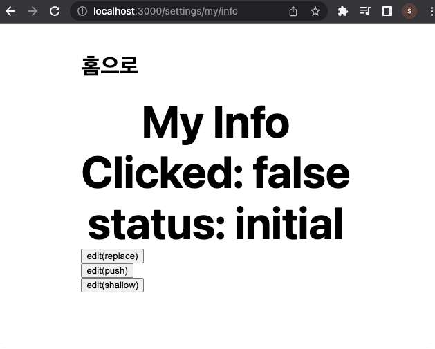

# Part2 'Next.js 시작하기' 이어서

### 스타일 변경


isr.js와 CSR나 SSG와 스타일이 다른 것을 볼 수 있다. 이는 layout.js가 그 컴포넌트 안에서만 동작하기 때문이다. 이번에는 layout.js의 스타일을 글로벌로 변경할 것이다.

```JavaScript
// layout.js

//...

<style jsx>{
        .container {`

      `}</style>
```

컨테이너 안에 있는 스타일 요소들을 global 스타일로 옮겼다. (기존 <\style jsx>은 제거했다.)

```JavaScript
// layout.js
      <style jsx global>{`
        html,
        body {
          padding: 0;
          margin: 0;
          font-family: -apple-system, BlinkMacSystemFont, Segoe UI, Roboto, Oxygen, Ubuntu, Cantarell, Fira Sans,
            Droid Sans, Helvetica Neue, sans-serif;
        }

        * {
          box-sizing: border-box;
        }

        .container {
          min-height: 100vh;
```

변경했다면 a 태그의 스타일이 바뀌었을 것이다.


---

## 04 **Routing**

Next.js의 Router는 **file-system** 기반이다.(React는 따로 기능을 제공하지 않기 때문에, React Router라는 라이브러리를 사용했다.) 웹에서는 url과 그 url에 대응하는 리소스를 연결한다. file-system 기반이므로 파일을 만들면 그것이 즉각적으로 라우터로 인지되고, 주소와 매핑이 된다.

pages/ 혹은 src/pages/ 에서 라우팅 기능을 적용할 수 있다.

라우팅 기능을 살피기 위해 이전에 진행한 learn-starter 프로젝트를 이용할 것이다. 디렉터리에 [src]란 폴더를 만들고, 폴더에 레이아웃이 담긴 [components]를 옮겼다.


그러면 기존 Layout과 SubLayout을 불러오던 코드들에도 경로 변경이 적용된 모습을 확인할 수 있다.(VSCode에서 '가져오기를 업데이트'를 적용시켜 주었다.)

이어서 [src] 폴더 내부로 [pages]를 옮긴다. 이 경우도 경로가 다시 변경되었다.

그렇다면 pages/와 src/pages/ 모두에 index.js가 있다면 어떤 것이 표시가 될까? 정답은 pages/ 폴더 내 index.js가 표시된다.(src/pages 내부에 있는 index.js는 무시된다.)

### Nested routes

파일 시스템 기반이므로 폴더에 여러 depth가 생겼다면 그대로 반영된다. 아래는 하위 디렉터리를 만들었을 때 반영되는 예시다.

- pages/product/first-item.js => /product/first-item

- pages/settings/my/info.js => /settings/my/info

learn-starter에 동일하게 만들어 볼 것이다. [src] - [pages] - [product] 폴더를 만들고 first-item.js를 생성했다. import 경로가 바뀌는 점에 주의해야 한다.

```JavaScript
// first-item.js

import Layout from '../../components/layout'
import SubLayout from '../../components/SubLayout'

export default function FirstItem() {
  return (
    <>
      <h1 className="title">First Item</h1>
    </>
  )
}

FirstItem.getLayout = function getLayout(page) {
  return (
    <Layout>
      <SubLayout>{page}</SubLayout>
    </Layout>
  )
}
```

결과는 다음과 같다.


하지만 ../../과 같은 방식으로 경로를 import하면 depth가 깊어지면 실수 가능성이 늘 것이다. jsconfig.json 파일로 절대 경로를 지정하며 이런 문제를 해결할 수 있다.

jsconfig.json 파일에 아래와 같이 코드를 작성하여 'baseUrl'로 src를 지정했다.(파일은 새로 생성했다.)

```json
...
{
  "compilerOptions": {
    "baseUrl": "src"
  }
}
...
```

이제 first-item.js에 있는 상대 경로(../)로 작성한 부분을 모두 수정했다. yarn build, start를 거쳐서 실행하면 마찬가지로 잘 작동한다.

```JavaScript
import Layout from 'components/layout'
import SubLayout from 'components/SubLayout'
```

이번에는 pages/settings/my/info.js를 만들었다.

```JavaScript
// info.js
import Layout from 'components/layout'
import SubLayout from 'components/SubLayout'

export default function MyInfo() {
  return (
    <>
      <h1 className="title">My Info</h1>
    </>
  )
}

MyInfo.getLayout = function getLayout(page) {
  return (
    <Layout>
      <SubLayout>{page}</SubLayout>
    </Layout>
  )
}
```


참고로 http://localhost:3000/settings/my/ 로 접근하면 오류가 뜬다.


my에 바로 접근할 수 있으려면 index.js 파일이 디렉터리 안에 있어야 한다.

### slug

대괄호를 써서 [] 와일드카드처럼 동작하는 기능이다.

- pages/category/[slug].js => /category/:slug (ex. /category/food)

- pages/[username]/info.js => /:username/info (ex. /jimmy/info)

기능을 확인하기 위해 우선 pages/category/[slug].js 를 구현하겠다. [category] 디렉터리와 내부에 [slug].js를 구현하였다.

```JavaScript
// [slug].js
import Layout from 'components/layout'
import SubLayout from 'components/SubLayout'

export default function CategorySlug() {
  return (
    <>
      <h1 className="title">Category Slug</h1>
    </>
  )
}

CategorySlug.getLayout = function getLayout(page) {
  return (
    <Layout>
      <SubLayout>{page}</SubLayout>
    </Layout>
  )
}
```

이렇게 구현했다면 http://localhost:3000/category/* 로 *에 어떤 것을 넣어도 [slug].js로 연결이 된다.


이번에는 pages/[username]/info.js 구현해 볼 것이다. [[username]] 디렉터리를 만들고 내부에 info.js를 생성했다.

username 부분으로 erectbranch를 입력 결과 잘 작동된다.


그렇다면 http://localhost:3000/category/info 로 이동하면 어떻게 될까?


**명시해 둔 값이 우선 순위**를 가지며 결국 category/[slug].js 형식으로 나타난다.

### ...slug

...을 쓰면 depth가 아무리 깊어져도 적용할 수 있다.

- pages/cart/[...slug].js => /cart/\* (ex. /cart/2022/06/24)

구현을 위해 [cart] 디렉터리를 만든 뒤 [...date].js 파일을 만들었다.

http://localhost:3000/cart/2022/06/24 에 접속하면 다음과 같이 나타난다.


---

## **05 Shallow Routing**

그렇다면 어떻게 이런 기능을 사용하면 될까? import { useRouter } from 'next/router'로 router 라이브러리 내 useRouter 함수를 사용할 수 있다. 이 함수를 이용하면 query의 slug를 꺼내볼 수 있다.

```JavaScript
import { useRouter } from 'next/router'

const router = useRouter()
const { slug } = router.query
```

함수를 이용하기 위해 learn-starter 프로젝트의 [src] - [pages] - [category] - [slug].js 파일을 수정해 보겠다.

```JavaScript
import Layout from 'components/layout'
import SubLayout from 'components/SubLayout'
import { useRouter } from 'next/router'

export default function CategorySlug() {
  const router = useRouter()
  const { slug } = router.query
  return (
    <>
      <h1 className="title">Category {slug}</h1>
    </>
  )
}

CategorySlug.getLayout = function getLayout(page) {
  return (
    <Layout>
      <SubLayout>{page}</SubLayout>
    </Layout>
  )
}

```

이제 http://localhost:3000/category/food 로 접근하면 다음과 같이 뜬다.


이렇게 food로 접근한 사용자에게는, 서버는 query를 확인해서 food와 관련된 정보를 주면 된다. 다른 예시로 sport로 접근한 사용자라면 sport와 관련된 정보를 표시할 수 있다.

또 다른 방식으로 query를 활용할 수도 있다.(url에 ?{쿼리}로 전달하는 방식으로 사용) 아래와 같이 [slug].js 코드에 from을 더 추가해 보았다.

```JavaScript
export default function CategorySlug() {
  const router = useRouter()
  const { slug, from } = router.query
  return (
    <>
      <h1 className="title">Category {slug} from {from}</h1>
    </>
  )
}
```

이렇게 구성했을 경우 http://localhost:3000/category/food?from=event 에 접근하면 다음과 같이 표시된다.


더 늘릴 수도 있다.

```JavaScript
export default function CategorySlug() {
  const router = useRouter()
  const { slug, from, age } = router.query
  return (
    <>
      <h1 className="title">
        Category {slug} from {from} {age}
      </h1>
    </>
  )
}
```

http://localhost:3000/category/food?from=event&age=20 로 접근하면 다음과 같이 표시된다.


그렇다면, query에도 slug가 있다면 어떻게 될까? 예를 들어 앞서 본 예제에 ?slug=sport가 온 경우다.

http://localhost:3000/category/food?from=event&slug=sport 로 접근하면 다음과 같이 표시된다. 페이지 구조 안에서 사용한 slug가 우선 순위를 가지며, 뒤에 쓴 slug는 무시된다.(앞의 주소가 손상되지 않도록)


이번에는 from으로 값을 두 개를 전달하면 어떻게 될까? http://localhost:3000/category/food?from=event&slug=sport&from=home 에 접근하면 다음과 같이 표시된다. 이 경우는 두 쿼리가 모두 전달된다.


### 다중 슬러그

이번에는 한 주소에 슬러그를 여러 개 사용할 것이다.

- pages/[username]/[info].js

작동을 확인하기 위해 기존 info.js를 [info].js로 이름을 바꿔서 슬러그를 적용했다. useRouter 함수를 이용해 쿼리를 읽도록 작성했다.(위를 const { username, info } = router.query로 읽어들일 것이다.)

```JavaScript
//[info].js
import Layout from 'components/layout'
import SubLayout from 'components/SubLayout'
import { useRouter } from 'next/router'

export default function UserName() {
  const router = useRouter()
  const {username, info} = router.query
  return (
    <>
      <h1 className="title">{username}'s {info}</h1>
    </>
  )
}

UserName.getLayout = function getLayout(page) {
  return (
    <Layout>
      <SubLayout>{page}</SubLayout>
    </Layout>
  )
}
```

http://localhost:3000/erectbranch/github 에 접근하면 다음과 같이 표시된다.


그렇다면 ...슬러그는 어떻게 쿼리를 전달 받아야 할까? 이 경우 배열로 받아지게 된다. 아래 예제에서 확인하자.

- pages/cart/[...date].js

쿼리를 읽어들이기 위해서 const {date} = router.query를 추가할 것이다.

```JavaScript
// [...date].js
import Layout from 'components/layout'
import SubLayout from 'components/SubLayout'
import { useRouter } from 'next/router'

export default function CartDateSlug() {
  const router = useRouter()
  const {date} = router.query
  return (
    <>
      <h1 className="title">Cart Date Slug {JSON.stringify(date)}</h1>
    </>
  )
}

CartDateSlug.getLayout = function getLayout(page) {
  return (
    <Layout>
      <SubLayout>{page}</SubLayout>
    </Layout>
  )
}
```

http://localhost:3000/cart/2022/06/24 에 접근하면 다음과 같이 배열을 표기한다.


### 옵셔널 슬러그

pages/cart/[...date].js 처럼 슬러그가 있다고 해서 http://localhost:3000/cart/ 로 cart 뒤에 아무런 입력 없이 접근하면 오류가 뜬다. 슬러그 값이 없으면 동작하지 않는다. 만약 값을 주지 않아도 슬러그가 동작하게 만드려면 대괄호를 두 번 사용하면 된다.

아래는 대괄호를 [[...date]].js로 두 번 적용한 뒤 http://localhost:3000/cart/ 로 접근한 결과이다. 입력이 더 없어도 슬러그가 작동한다.


### Routing 적용

대체로 두 가지 방법을 많이 활용한다.

- <Link href="url"> url로 </Link>

- router.push("url")

첫 번째 방법을 앞서 살핀 [[...date]].js 파일에 적용할 것이다.

```JavaScript
// [[...date]].js
//...
import Link from 'next/link'

//...
      <h1 className="title">Cart Date Slug {JSON.stringify(date)}</h1>
      <Link href="/cart/2022/06/05"> 2022년 6월 5일로 </Link>
```

http://localhost:3000/cart/로 접근하면 다음과 같이 표시된다.


2022년 6월 5일로 문자열을 클릭 시 http://localhost:3000/cart/2022/06/05 로 이동한다.


router.push를 이용해서 /cart/2022/06/05 로 보내주는 버튼도 구현해 보자.

```JavaScript
      <h1 className="title">Cart Date Slug {JSON.stringify(date)}</h1>
      <Link href="/cart/2022/06/05"> 2022년 6월 5일로 </Link>
      <br />
      <button onClick={() => router.push('/cart/2022/06/24')}>
        2022년 6월 24일로
      </button>
```


버튼을 누르면 http://localhost:3000/cart/2022/06/24 로 이동한다.


### Shallow Routing

Shallow Routing란 getServerSideProps / getStaticProps 등을 다시 실행시키지 않고, 현재 상태를 잃지 않고 url을 바꾸는 방법을 의미한다.(다시 Data fetching을 발생시키지 않는다.)

다시 말하면 상태를 유지하면서도 url만 바꾸는 기술이다. 사용자가 어떤 동작을 하면 그 기록을 query로 남긴다.(query로 남기면 사용자가 새로고침을 해도 유지된다.)

이를 알기 위해서 우선 url을 바꾸는 세 가지 방식을 살펴보자.

1. location.replace("url"): 로컬 state 유지가 되지 않는다.(리렌더)

2. router.push("url"): 로컬 state 유지 / data fetching은 일어난다.

3. router.push("url", as, { shallow: true }): 로컬 state 유지 / data fetching x

이 방식들이 어떻게 다른지 예제를 수정하면서 알아볼 것이다. [src] - [pages] - [setting] - [my] - info.js 파일을 이용한다.

```JavaScript
// info.js
import Layout from 'components/layout'
import SubLayout from 'components/SubLayout'
import { useRouter } from 'next/router'
import { useState } from 'react'

export async function getServerSideProps() {
  console.log('server')

  return {
    props: {},
  }
} // Data fetching 확인용

export default function MyInfo() {
  const router = useRouter()
  const [clicked, setClicked] = useState(false)
  const { status = 'initial' } = router.query
  return (
    <>
      <h1 className="title">My Info</h1>
      <h1 className="title">Clicked: {String(clicked)}</h1>
      <h1 className="title">status: {status}</h1>
      <button // location.replace("url")
        onClick={() => {
          alert('edit')
          setClicked(true)
          location.replace('/settings/my/info?status=editing')
        }}
      >
        edit(replace)
      </button>
      <br />
      <button // router.push("url")
        onClick={() => {
          alert('edit')
          setClicked(true)
          router.push('/settings/my/info?status=editing')
        }}
      >
        edit(push)
      </button>
      <br />
      <button // router.push("url", as, { shallow: true })
        onClick={() => {
          alert('edit')
          setClicked(true)
          router.push('/settings/my/info?status=editing', undefined, {
            shallow: true,
          })
        }}
      >
        edit(shallow)
      </button>
      <br />
    </>
  )
}

MyInfo.getLayout = function getLayout(page) {
  return (
    <Layout>
      <SubLayout>{page}</SubLayout>
    </Layout>
  )
}
```

http://localhost:3000/settings/my/info 를 실행 시 다음과 같은 화면이 표시된다. 각 버튼은 각각의 routing 방식을 구현한 버튼이다.



> const [clicked, setClicked] = useState(false): [변수, 함수] 형식으로 정의되면서, clicked는 상태를 저장하는 변수, setClicked는 상태는 갱신시키는 함수가 된다.

클릭 시 setClicked(true) 문장에 의해 clicked가 false에서 true로 바뀐다. 또한 query로 status에 editing을 읽어 오면서 initial에서 editing으로 바뀐다. 만약 Data fetching이 일어난다면 서버 콘솔에 server라는 문자열이 출력될 것이다.

1. 첫 번째 버튼(location.replace("url"))

우선 location.replace("url") 방식의 첫 번째 버튼을 누르면 어떤 변화가 있는지 확인해 보자.

edit alert가 뜨고 Clicked: true로 바뀌었다가, 곧바로 false로 다시 돌아간다. false로 바뀌는 이유는 http://localhost:3000/settings/my/info?status=editing 이란 url을 표시하기 위해 다시 리렌더가 일어나기 때문이다. Data Fetching이 일어났기 때문에 서버 콘솔에 server 문자열이 출력된다.


2. 두 번째 버튼(router.push("url"))

이번에는 router.push("url") 방식의 두 번째 버튼을 확인한다.

마찬가지로 edit alert가 뜨고 Clicked: true로 바뀐다. 이번에는 true가 유지된다. 즉, 로컬 state가 유지된다. 하지만 Data Fetching이 일어났기 때문에 서버 콘솔에 server 문자열이 출력된다.


3. 세 번째 버튼(router.push("url", as, { shallow: true }))

이번에는 router.push("url", as, { shallow: true }) 방식의 세 번째 버튼을 확인한다.

마찬가지로 edit alert가 뜨고 Clicked: true로 유지된다.(로컬 state가 유지된다.) 또한 Data Fetching이 일어나지 않기 때문에 서버 콘솔에 문자열이 출력되지 않는다.

하지만 이는 **query만 바뀌고 원래의 url은 바뀌지 않기 때문에** data fetching을 하지 않고 유지할 수 있는 것이다. 만약 url을 바꾸면 리렌더를 하게 된다.


---

## **06 API Routes**

우선 API란 Application Programming Interface로 응용 프로그래밍 인터페이스를 뜻한다. 컴퓨터와 컴퓨터 프로그램 사이(혹은 프로그램과 프로그램 사이)의 연결이다.

고객이 DB에 접근하기 위해 FE(프론트엔드)는 BE(백엔드)와 연결되어야 하고, 이때 API를 활용한다. BE가 제공해주는 API를 통해 DB 내용을 활용할 수 있다.

> 커머스 사이트에서 개발자 도구의 네트워크 탭을 보면 통신 과정을 이해하는 데 도움이 된다.

Next.js가 제공하는 API Routes는 다음과 같다.

- pages/api/\*

learn-starter 프로젝트 예제로 API 기능을 살펴보자. [src] - [pages] - [api] - user.js를 생성했다.([api] 디렉터리랑 user.js 파일 모두 생성했다.)

handler 함수 안에 json 형태로 { name: 'Jimmy Choi' }를 기록해 두었다.

```JavaScript
// user.js
export default function handler(req, res) {
  res.status(200).json({ name: 'Jimmy Choi' })
}
```

이제 [src] - [pages] - [[username]] - [info].js 파일에서 이 내용을 조회할 것이다.

```JavaScript
// [info].js
import Layout from 'components/layout'
import SubLayout from 'components/SubLayout'
import { useRouter } from 'next/router'
import { useEffect } from 'react'
import { useState } from 'react'

export default function UserName() {
  const router = useRouter()
  const { username, info } = router.query
  const [name, setName] = useState('?')

  useEffect(() => {
    fetch('/api/user')
      .then((res) => res.json())
      .then((data) => {
        setName(data.name)
      })
  }, [])

  return (
    <>
      <h1 className="title">
        {username}'s {info}
      </h1>
      <h1 className="title">Name: {name}</h1>
    </>
  )
}

UserName.getLayout = function getLayout(page) {
  return (
    <Layout>
      <SubLayout>{page}</SubLayout>
    </Layout>
  )
}
```

http://localhost:3000/jimmy/name 로 접속하면 다음과 같이 표시된다.


jimmy's name까지는 기존에 구현한 기능으로(query를 읽어서 표시), 다음 줄인 Name: Jimmy Choi이 바로 API를 이용하여 만든 기능이다. 헤더의 상태 코드 200 OK라고 표시된 것은 res.status(200)로 설정했기 때문이다. 요청 URL: http://localhost:3000/api/user 는 api/user.js API를 사용했기 때문이다.

개발자 도구 네트워크 탭의 응답을 누르면 {"name":"Jimmy Choi"}를 받아온 것을 확인할 수 있다.


하지만 실제로 기능을 사용한다면 API에 기록해 둔 내용이 아닌 DB에서 한 번 받아올 것이다. 비슷한 과정을 구현하기 위해 [src] 폴더에 (DB를 대신할 예시로) 고정 값들을 저장하는 [constants] 디렉터리를 생성했다. 내부에 userDetail.js 파일을 만들어서 json 형태로 사용자 정보를 기록했다.

```JavaScript
// userDetail.js

export const userDetail = {
  name: 'Minsu Kim',
  age: 12,
  height: '1.3m',
  weight: '40kg',
}
```

이제 API에서 import해서 다룰 것이다. user.js 파일을 수정해 보자.

```JavaScript
// user.js
import { userDetail } from "constants/userDetail"

export default function handler(req, res) {
  res.status(200).json(userDetail)
}
```

name을 Minsu Kim으로 설정했으므로 http://localhost:3000/jimmy/name 에서 새로고침 시 바뀌게 된다.


### Dynamic API Routes

Dynamic API도 동일하게 가능하다. 아래 예제로 실험을 할 것이다.

- pages/api/user-info/[uid].js

[api]에 [user-info] 폴더를 만든 뒤 [uid].js 파일을 슬러그 형태로 만들었다. query를 읽어서 uid를 전달 받을 것이다.

```JavaScript
// [uid].js
export default function handler(req, res) {
  const { uid } = req.query
  res.status(200).json({ name: `Jimmy Choi ${uid}` })    // 문자열 리터럴 ` 사용
}
```

[src] - [pages] - [[username]] - [info].js 파일에서 이번에는 uid를 읽을 것이다. 'const { username, info, uid } = router.query' 문장으로 ?uid=로 들어오는 값을 받아 사용한다.

```JavaScript
// [info].js
//...
export default function UserNameInfo() {
  const router = useRouter()
  const { username, info, uid } = router.query
  const [name, setName] = useState('?')

  useEffect(() => {
    fetch(`/api/user-info/${uid}`)   // 문자열 리터럴 ` 사용에 주의
      .then((res) => res.json())
      .then((data) => {
        setName(data.name)
      })
  }, [])

  //...
}

//...
```

하지만 http://localhost:3000/jimmy/name?uid=1 로 접근해도 제대로 작동하지 않는다.


개발자 도구로 어떤 상황인지 살펴 보자.


잘 보면 요청 URL: http://localhost:3000/api/user-info/undefined 로 undefined에 요청하고 있다. 왜냐하면 처음 렌더링을 할 시점에는 uid가 undefined 상태이기 때문이다. 따라서 다음과 같이 uid가 있을 때(!= null)만 값을 받아오도록 코드를 수정할 것이다.

```JavaScript
// // [info].js
  useEffect(() => {
    if (uid != null) {
      fetch(`/api/user-info/${uid}`)
        .then((res) => res.json())
        .then((data) => {
          setName(data.name)
        })
    }
  }, [uid])    // uid가 바뀌면 렌더가 다시 이루어진다.
```

이번에는 제대로 반영이 된다.


응답 탭을 봐도 제대로 {"name":"Jimmy Choi 1"}로 불러온 것을 확인할 수 있다.


이런 식으로 slug를 사용하면서 Routing을 다양하게 작성할 수 있다.

### API Middlewares

앞서 const { uid } = req.query를 사용한 것처럼, 내장 Middleware의 기능을 사용하면 더 다양한 Routing이 가능하다.(req.query / req.cookies 등) req / res 관련 다양한 기능들은 Middleware를 활용할 수 있다.(CORS(교차 출처 리소스 공유) 등)

이번에는 cookie를 가져와서 활용해 보자. 아래는 [src] - [pages] - [api] - [user-info] - [uid].js 파일 코드이다.

```JavaScript
// [uid].js
export default function handler(req, res) {
  const { uid } = req.query
  const cookies = req.cookies
  res.status(200).json({ name: `Jimmy Choi ${uid} ${JSON.stringify(cookies)}` })
}
```


하지만 현재 쿠키가 없기 때문에 {} 안이 비어 있다. 개발자 도구에서 [애플리케이션] 탭 - [저장용량] - [쿠키] - https://localhost:3000 을 선택하여 쿠키를 생성한다. 테이블을 더블클릭해서 생성할 수 있다.


새로고침을 하면 비어 있던 공간에 쿠키 내용이 담긴다. 쿠키가 서버까지 전달되고, 서버가 다시 이것을 응답으로 준 것이다.


### Response

이전 예제에서 'res.status(200).json({ name: 'Jimmy Choi' })'와 같은 코드를 이용했다. 이것은 요청에 대한 응답으로 상태 코드 200(OK: 서버가 요청을 성공적으로 처리)과 JSON 형태 응답을 넘긴 것이다.

[uid].js 파일의 응답을 바꿔 보자.

```JavaScript
// [uid].js
export default function handler(req, res) {
  const { uid } = req.query
  const cookies = req.cookies
  res.status(500).send({ error: 'error' })
}

```

상태 코드 500은 Internal Server Error로, 서버에 오류가 발생하여 요청을 수행할 수 없다는 의미이다. 새로고침을 하면 다음과 같이 뜨게 된다.


응답 탭은 {"error":"error"}가 표시된다.


비슷한 방식으로 404로 설정하면 404 not found 오류가 발생하게 된다.

이번에는 res.redirect에 307 코드를 넣어 보았다. (user.js API는 userDetail.js 파일을 DB처럼 json으로 읽어오는 API였다.)

```JavaScript
// [uid].js
export default function handler(req, res) {
  const { uid } = req.query
  const cookies = req.cookies
  res.redirect(307, '/api/user')
}
```

결과는 다음과 같다. 참고로 307(Temporary Redirect)은 현재 서버가 다른 위치의 페이지로 요청에 응답하고 있지만, 향후에는 원래의 URI로 요청해야 한다는 의미다.

참고로 [src] - [pages] - [[username]] - [info].js의 API 코드 부분은 다음과 같았다.

```JavaScript
// [info].js
  useEffect(() => {
    if (uid != null) {
      fetch(`/api/user-info/${uid}`)
        .then((res) => res.json())
        .then((data) => {
          setName(data.name)
        })
    }
  }, [uid])
```

따라서 api/user-info/1 에서는 오류가 발생하고, api/user로 리다이렉트되어 (치환되면서) 실행된다.


---
