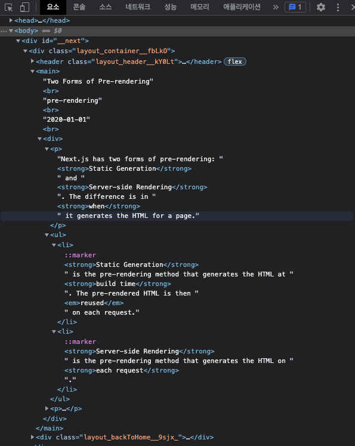
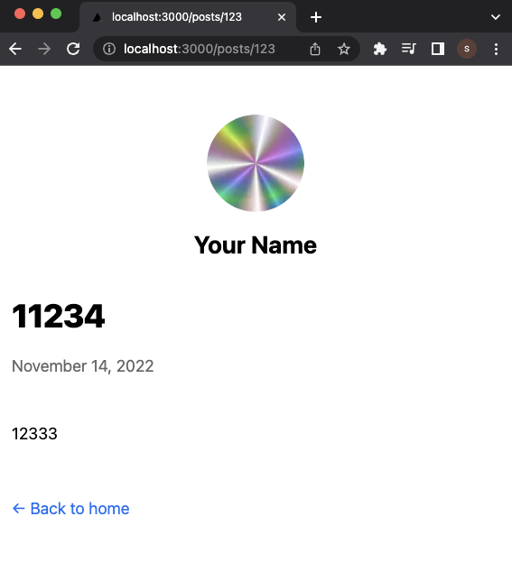
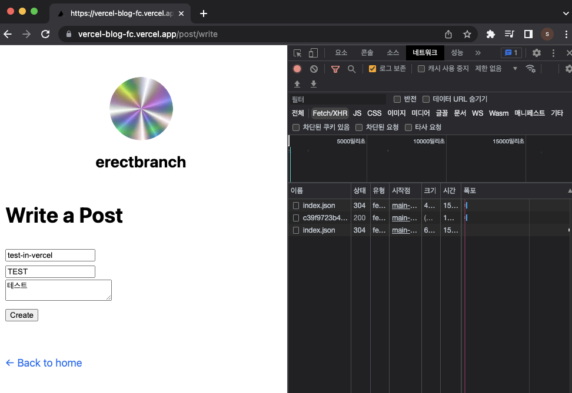

# Part2 Practice : 블로그 프로젝트 이어서

지금까지 md 파일들(posts/ssg-ssr.md, posts/pre-rendering.md)을 가져와서 읽었다.

## **04 Dynamic Routes**

이제 다음과 같은 예제를 진행할 것이다.

요구사항: SSG를 사용해서,

- url: /posts/ssg-ssr이면 posts/ssg-ssr.md를 읽어서 보여준다.

- url: /posts/pre-rendering이면 posts/pre-rendering.md를 읽어서 보여준다.

이런 요구사항을 구현하려면, 먼저 /pages/posts/[slug].js가 떠올랐어야 한다. 이전에 id로 파일 이름을 전달했던 것을 이용하므로, 편의상 slug 대신 id라 표기할 것이다. 또한 SSG로 다이나믹한 pages들을 생성하므로 getStaticPaths() 함수도 필요하다.(getStaticPaths는 생성해 두어야 할 페이지 정보를 배열로 반환해야 했었다.)

시작 전 [pages] - [posts] - first-post.js 파일의 이름을 [id].js로 바꾸고 함수 이름을 Post() 로 변경했다. second-post.js는 삭제했다.

```JavaScript
// [id].js
// ...

export default function Post() {
    //...
}
```

Next.js 예제 함수를 그대로 이용할 것이다.

> [Next.js: 포스트 이름을 모두 가져오는 함수(getAllPostIds)](https://nextjs.org/learn/basics/dynamic-routes/implement-getstaticpaths)

> [Next.js: id를 가지고 포스트 내용을 가져오는 함수(getPostData)](https://nextjs.org/learn/basics/dynamic-routes/implement-getstaticprops)

우선 getAllPostIds() 함수를 [lib] - posts.js 안에 넣는다. 하단에 새로 추가했다.

```JavaScript
// posts.js
//...

export function getAllPostIds() {
  const fileNames = fs.readdirSync(postsDirectory);

  // Returns an array that looks like this:
  // [
  //   {
  //     params: {
  //       id: 'ssg-ssr'
  //     }
  //   },
  //   {
  //     params: {
  //       id: 'pre-rendering'
  //     }
  //   }
  // ]
  return fileNames.map((fileName) => {
    return {
      params: {
        id: fileName.replace(/\.md$/, ''),
      },
    };
  });
}
```

이제 [pages] - [posts] - [id].js에 getStaticPaths 함수를 만들어 준다. Next.js 공식 문서에 있는 예제 그대로 만들었다.

```JavaScript
// [id].js
// ...
import { getAllPostIds } from '../../lib/posts'

export async function getStaticPaths() {
  const paths = getAllPostIds()
  return {
    paths,
    fallback: false,
  }
}

// ...
```

여기서 fallback 값은 빌드 시 생성되지 않은 page를 어떻게 처리하는가를 결정한다.

> [Next JS Static Generation - fallback](https://velog.io/@mskwon/next-js-static-generation-fallback)

- false: build 시 생성하지 않았다면, 페이지와 연결이 되지 않는다.(404 error)

- true: path가 build 당시에는 없었지만, 이후 데이터가 새로 생기며 get~Props로 조회를 했을 때 그려야 하는 경우 사용한다. 페이지가 없다면 fallback 버전을 렌더링한 뒤, 페이지가 생성이 완료되면 이 페이지를 저장하고, 보여주게 된다.

- blocking: 렌더링을 하지 않다가(fallback 버전 페이지 자체를 만들지 않는다.), 파일이 생기면 그 때 렌더링을 진행한다.

다음은 [lib] - posts.js 하단에 getPostData 함수를 추가한다. postsDirectory는 이미 이전에 정의한 적 있었다. getPostData 함수는 id를 인자로 받아서 해당 id.md 파일을 타겟팅해서 읽는다.

```JavaScript
// posts.js

export function getPostData(id) {
  const fullPath = path.join(postsDirectory, `${id}.md`);
  const fileContents = fs.readFileSync(fullPath, 'utf8');

  // Use gray-matter to parse the post metadata section
  const matterResult = matter(fileContents);

  // Combine the data with the id
  return {
    id,
    ...matterResult.data,
  };
}
```

[id].js 파일에 getStaticProps 함수를 추가한다. 앞서 추가한 getPostData 함수를 이용한다. 그리고 반환한 값을 Post()에 넣어서 화면에 표시했다.

```JavaScript
// [id].js
import Layout from '../../components/Layout'
import { getAllPostIds, getPostData } from '../../lib/posts'

// ...

export async function getStaticProps({ params }) {
  const postData = getPostData(params.id);
  return {
    props: {
      postData,
    },
  };
}

export default function Post({postData}) {
  return (
    <Layout>
      {postData.title}
      <br />
      {postData.id}
      <br />
      {postData.date}
    </Layout>
  )
}
```

아래는 http://localhost:3000/posts/ssg-ssr 에 접속한 결과이다. title, id, data를 순서대로 잘 읽은 것을 볼 수 있다.


### \*.md 파일을 해석하기 위한 도구 설치

이전까지는 \---로 감싸진 metadata(YAML Front Matter)를 읽었다. 이번에는 파일 자체를 해석하기 위한 도구를 설치할 것이다.

```bash
yarn add remark remark-html
```

markdown을 해석할 수 있도록 [lib] - posts.js 파일의 getPostData 함수를 확장한다.

> [Next.js: Render Markdown](https://nextjs.org/learn/basics/dynamic-routes/render-markdown)

```JavaScript
// posts.js
// ...
import { remark } from 'remark';
import html from 'remark-html';

// ...
export async function getPostData(id) {
  const fullPath = path.join(postsDirectory, `${id}.md`)
  const fileContents = fs.readFileSync(fullPath, 'utf8')

  // Use gray-matter to parse the post metadata section
  const matterResult = matter(fileContents)

  const processedContent = await remark()
    .use(html)
    .process(matterResult.content);
  const contentHtml = processedContent.toString();

  // Combine the data with the id
  return {
    id,
    contentHtml,
    ...matterResult.data,
  }
}
```

추가로 [pages] - [posts] - [id].js의 getStaticProps에도 await를 추가해야 한다. 이후 Post 내부에 읽은 내용을 표시하도록 코드를 추가했다.

```JavaScript
// [id].js
// ...

export async function getStaticProps({ params }) {
  const postData = await getPostData(params.id)
  return {
    props: {
      postData,
    },
  }
}

export default function Post({ postData }) {
  return (
    <Layout>
      {postData.title}
      <br />
      {postData.id}
      <br />
      {postData.date}
      <br />
      <div dangerouslySetInnerHTML={{ __html: postData.contentHtml }} />
    </Layout>
  )
}
```

다음은 실제로 markdown 파일을 화면에 렌더링한 결과 사진이다.




pre-rendering.md 파일에 여러 문장을 추가하면 반영이 되는 것을 볼 수 있다.


### Date formatting 도구 설치

이제 블로그에 노출되는 글 목록을 폴리싱(polishing, 디자인을 가다듬기)할 것이다. parseISO, format 를 이용한다.

```bash
yarn add date-fns
```

설치가 끝나면, [components] 디렉터리에 Date.js 파일을 만든다.

> [Next.js: Polishing the Post Page](https://nextjs.org/learn/basics/dynamic-routes/polishing-post-page)

공식 문서에 있는 parseISO, format를 이용한다.

```JavaScript
// Date.js
import { parseISO, format } from 'date-fns';

export default function Date({ dateString }) {
  const date = parseISO(dateString);
  return <time dateTime={dateString}>{format(date, 'LLLL d, yyyy')}</time>;
}
```

이제 이 컴포넌트를 사용해 보자. [id].js에 다음과 같이 추가했다.

```JavaScript
// [id].js
import Date from '../../components/Date'
//...

export default function Post({ postData }) {
  return (
    <Layout>
      {postData.title}
      <br />
      {postData.id}
      <br />
      <Date dateString={postData.date}/>
      <br />
      <div dangerouslySetInnerHTML={{ __html: postData.contentHtml }} />
    </Layout>
  )
}
```

그럼 다음과 같이 'LLLL d, yyyy' 형태로 나오는 것을 확인할 수 있다.


여기에 CSS로 스타일을 더할 것이다. 기존에 만든 [styles] - utils.module.css를 활용한다. [id].js를 다음과 같이 변경했다.

```JavaScript
// [id].js
// ...
import utilStyles from '../../styles/utils.module.css'

// ...

export default function Post({ postData }) {
  return (
    <Layout>
      <article>
        <h1 className={utilStyles.headingXl}>{postData.title}</h1>
        <div className={utilStyles.lightText}>
          <Date dateString={postData.date} />
        </div>
        <br />
        <div dangerouslySetInnerHTML={{ __html: postData.contentHtml }} />
      </article>
    </Layout>
  )
}
```

결과는 다음과 같다.


이제 Index 페이지도 스타일을 더할 것이다.

> [Next.js: Polishing the Index Page](https://nextjs.org/learn/basics/dynamic-routes/polishing-index-page)

```JavaScript
// index.js
// ...
import Link from 'next/link';
import Date from '../components/Date';

// ...
          {allPostsData.map(({ id, date, title }) => (
            <li className={utilStyles.listItem} key={id}>
              <Link href={`/posts/${id}`}>{title}</Link>
              <br />
              <small className={utilStyles.lightText}>
                <Date dateString={date} />
              </small>
            </li>
          ))}
// ...
```

결과는 다음과 같다.


---

## **05 API Routes**

예제를 진행하기 앞서 먼저 index.js를 수정했다. 앞서 신경을 쓰지 않았지만, 다음과 같은 부분에 더 유의해야 한다.

- server-side에서는 API Routes는 사용하지 않아야 한다.

- getStaticProps / getStaticPaths 등은 client-side 코드에 포함되지 않는다.

그렇기에 서버 사이드에서는 DB에 직접 접근하는 등 훨씬 자유도 높은 작업을 할 수 있는 것이다.

```JavaScript
import Head from 'next/head'
import Link from 'next/link'
import Layout, { siteTitle } from '../components/Layout'
import { getSortedPostsData } from '../lib/posts'
import utilStyles from '../styles/utils.module.css'
import Date from '../components/Date'

export async function getStaticProps() {
  const allPostsData = getSortedPostsData()

  return {
    props: {
      allPostsData,
    },
  }
}

export default function Home({ allPostsData }) {
    //...
}
```

### 글 작성 기능 구현하기

요구사항: 이번에는 /post/write 페이지에서 새로운 글을 쓰는 기능을 추가할 것이다. 만들자고 정했다면 생각의 순서는 다음과 같다.

- Page가 필요하겠지? 여러 input을 받을 수 있는... => pages/post/write.js로 구현

- API도 필요하겠네? file에 저장할 input을 받는... => pages/api/post/write.js로 API 추가

- 글을 저장하는 함수도 필요하겠다. 실제 file로 저장하는... => lib/posts.js 안에 createPost 함수 추가

- 작성이 성공하면 해당 page로 가는 Link도 제공하면 편리하겠네.

1. Page 생성

[pages] - [post] 디렉터리를 만들고 내부에 write.js를 생성했다. 이전에 설치한 부가기능 'React Snippets'을 이용하면 간편하게 내용을 적을 수 있다. rfc를 타이핑하고 추천으로 표시되는 것을 누르면 다음과 같이 작성된다. import 부분만 삭제했다.

```JavaScript
// write.js
import React from 'react'

export default function write() {
  return (
    <div>write</div>
  )
}
```

글을 작성할 수 있도록 레이아웃을 수정하자. (팁: import ~~ Layout 처럼 어딘가 소문자 대문자를 착각했을 것 같다면 VSCode 좌측 메뉴의 돋보기를 눌러서 키워드를 검색하면 찾을 수 있다.)

> [useRef 사용법 및 예제](https://itprogramming119.tistory.com/entry/React-useRef-%EC%82%AC%EC%9A%A9%EB%B2%95-%EB%B0%8F-%EC%98%88%EC%A0%9C): useState와 다르게 useRef는 Ref안의 내부 변수를 아무리 변경해도 컴포넌트는 다시 렌더링이 되지 않는다. 따라서 불필요한 렌더링을 방지한다.

> [Event.preventDefault() 메서드](https://developer.mozilla.org/ko/docs/Web/API/Event/preventDefault): 예제에서는 누르면 url이 바뀌는 동작을 막기 위해 사용하였다.

```JavaScript
// write.js
// import React from 'react' 이 부분은 삭제한다.
import Layout from '../../components/Layout'
import { useRef } from 'react'

export default function write() {
  const idRef = useRef(undefined)
  const titleRef = useRef(undefined)
  const contentRef = useRef(undefined)

  const handleSubmit = (event) => {
    event.preventDefault()
  }
  return (
    <Layout>
      <h1>Write a Post</h1>
      <form onSubmit={handleSubmit}>
        <input type="text" name="id" placeholder="id" required ref={idRef} />
        <br />
        <input
          type="text"
          name="title"
          placeholder="title"
          required
          ref={titleRef}
        />
        <br />
        <textarea
          type="text"
          name="content"
          placeholder="content"
          required
          ref={contentRef}
        />
        <br />
        <input type="submit" value="Create" />
      </form>
    </Layout>
  )
}
```

그러면 다음과 같이 구성된다.


2. API 생성

이제 API를 만들어 보자. [pages] - [api] - [post] 디렉터리를 새로 만들고, 내부에 write.js 파일을 생성했다.

```JavaScript
// write.js

export default async function handler(req, res) {
  const { id, title, content } = req.body

  try {
    res.status(200).json({ message: 'create success' })
  } catch (error) {
    res.status(500).json({ error: `create failed ${error}` })
  }
}
```

3. 작성한 Post를 파일로 저장하는 함수 생성

[lib] - post.js 파일에 다음과 같은 코드를 추가한다.

```JavaScript
// post.js
// ...

export async function createPost({ id, title, date, content }) {
  const fullPath = path.join(postsDirectory, `${id}.md`)

  // YAML Front Matter 와 동일한 형식
  // 이 데이터를 파일로 저장할 것이다.
  // 앞에 들여쓰기를 넣으면 파일 생성마다 들여쓰기가 붙으니 유의해서 작성한다.
  const data = `---
title: '${title}'
date: '${date}'
---

${content}`

  fs.writeFileSync(fullPath, data)
}
```

이제 API에서 호출해 보자. 글이 저장이 되면 호출하도록 await 코드를 추가한다. 다음은 [pages] - [api] - [post] 내 write.js 파일이다.

```JavaScript
// write.js
import { createPost } from '../../../lib/posts'    // YAML Front Matter 와 동일한 형식으로 파일을 저장하는 createPost 함수를 불러온다.
import { format } from 'date-fns'

export default async function handler(req, res) {
  const { id, title, content } = req.body

  try {
    await createPost({
      id,
      title,
      date: format(new Date(), 'yyyy-MM-dd'),    // 서버에서 요청받은 시간을 포맷에 따라
      content,
    })
    res.status(200).json({ message: 'create success' })
  } catch (error) {
    res.status(500).json({ `error: create failed ${error}` })
  }
}
```

이제 만들어 둔 홈페이지와 연결하자. 아래는 [pages] - [post] - write.js 파일이다.

> [fetch() 함수로 원격 API 호출하기](https://www.daleseo.com/js-window-fetch/): POST 방식의 HTTP 통신 방법. method 옵션으로 POST, header 옵션을 통해 json 포멧임을 알려 주고, 요청 전문을 json 포멧으로 직렬화하여 가장 중요한 body 옵션에 설정해 준다.

```JavaScript
// write.js

//...

export default function write() {
  const idRef = useRef(undefined)
  const titleRef = useRef(undefined)
  const contentRef = useRef(undefined)

  const handleSubmit = (event) => {
    event.preventDefault()

    const id = idRef.current.value
    const title = titleRef.current.value
    const content = contentRef.current.value

    if (id && title && content) {
      fetch('/api/post/write', {
        method: 'POST',
        headers: { 'Content-Type': 'application/json' },
        body: JSON.stringify({
          id,
          title,
          content,
        }),
      })
        .then((response) => response.json())
        .then((data) => alert(data.message))
    }
  }

  return (
    //...
  )
}
```

response 부분에서 오류를 확인하기 위해서 코드를 더 추가했다.

```JavaScript
// write.js
// ...
        .then((response) => {
          if (response.ok) {
            return response.json()
          }
          throw new Error('Fetch Error')
        })
        .then((data) => alert(data.message))
        .catch((error) => alert(`request error: ${error}`))
```

아래는 http://localhost:3000/post/write 화면이다. id에 test, title에 Test Post, content에 md 형식으로 글을 작성했다.

오류가 발생하면 다음과 같이 뜨며


성공했을 때는 다음과 같은 알림이 표시됐다.


다음과 같이 [posts] 디렉터리에 text.md 파일이 생성되었다.


4. 작성 완료된 페이지 링크를 표시해 주는 기능 구현

아래는 [pages] - [post] - write.js 파일이다.

```JavaScript
// write.js
// ...
import { useRef, useState } from 'react'
import Link from 'next/link'

export default function write() {
  const idRef = useRef(undefined)
  const titleRef = useRef(undefined)
  const contentRef = useRef(undefined)

  const [showLink, setShowLink] = useState(false)

  // ...

      if (id && title && content) {
      fetch('/api/post/write', {
        method: 'POST',
        headers: { 'Content-Type': 'application/json' },
        body: JSON.stringify({
          id,
          title,
          content,
        }),
      })
        .then((response) => {
          if (response.ok) {
            return response.json()
          }
          throw new Error('Fetch Error')
        })
        .then((data) => {
          setShowLink(true)    // data가 생성되면 true로 상태를 바꿔 준다.
          alert(data.message)})
        .catch((error) => alert(`request error: ${error}`))
    }
  }

  // ...

  return (
    <Layout>
      <h1>Write a Post</h1>
      <form onSubmit={handleSubmit}>
      //...
      </form>
      {showLink && (
        <Link href={`/posts/${idRef.current.value}`}>Created Post Link</Link>
      )}
    </Layout>
  )
}
```

기능을 확인하기 위해 새로운 post를 작성했다.




### Fetch API

> [mdn: fetch()](https://developer.mozilla.org/en-US/docs/Web/API/fetch)

fetch() promise는 HTTP error에 의해 reject 되지 않는다. 확인을 위해 API를 조작해서 에러를 던지는 코드를 넣어 보자.

아래는 [pages] - [api] - [post] - write.js 파일이다.

```JavaScript
// write.js
// ...

export default async function handler(req, res) {
  const { id, title, content } = req.body

  try {
    throw new Error('nuclear launch detected')
    await createPost({
      id,
      title,
      date: format(new Date(), 'yyyy-MM-dd'), // 서버에서 요청받은 시간을 포맷에 따라
      content,
    })
    res.status(200).json({ message: 'create success' })
  } catch (error) {
    res.status(500).json({ error: 'create failed ${error}' })
  }
}
```

그리고 글을 작성해 보면 다음과 같이 fetch error가 뜬다.


이전에 작성한 코드를 상기해 보자. 아래는 [pages] - [post] - write.js 파일이다.

```JavaScript
//...
        .then((response) => {
          if (response.ok) {
            return response.json()
          }
          throw new Error('Fetch Error')
        })
        .then((data) => {
          setShowLink(true)
          alert(data.message)
        })
        .catch((error) => alert(`request error: ${error}`))
    }
```


이와 같이 ok가 아닌 경우 설정한 대로 Fetch Error가 뜬다.

---

## **06 vercel 배포하기**

### Vercel 배포하기

우선 지금까지 진행한 예제 디렉터리 복사해서 새로 만든다. 새로 만든 디렉터리명은 vercel-blog이다.

- cp [옵션] [원본파일명] [목적 파일명 / 디렉터리명] (-r: 하위 모든 디렉터리까지 포함해서 복사한다. -f: 덮어쓰기 제한 등을 무시하고 강제로 복사한다.)

```bash
cp -rf blog vercel-blog
```

VSCode를 실행하고, yarn 을 설치한다. 이후 yarn dev로 실행이 되는지 확인한다.

```bash
$ code vercel-blog

$ yarn

$ yarn dev
```

github에 새 레포지토리를 만든다. vercel-blog와 연동하고 git push --set-upstream origin master로 저장까지 진행했다. vercel 계정을 이용하여 저장소와 연동한다.

> [vercel 등록](https://vercel/signup): hobby로 등록

> [vercel Import Git Repository](https://vercel.com/new)

github와 vercel 연동은 별다른 설정 없이 Deploy 버튼을 누르고 진행했다.


> [vercel 연동 링크](https://vercel-blog-fc.vercel.app/)

생성된 배포 링크를 접속하면 다음과 같이 뜬다.


한번 글을 작성해 보자.

> [vercel 글 작성](https://vercel-blog-fc.vercel.app/post/write)

하지만 작성을 하기 위해 버튼을 누르면 오류가 뜬다.




```
error
:
"create failed Error: EROFS: read-only file system, open '/var/task/posts/test-in-vercel.md'"
```

에러는 위와 같은 내용으로, 오류가 뜨는 이유는 vercel에서 멋대로 파일 시스템을 바꿀 수 없기 때문이다.

---
