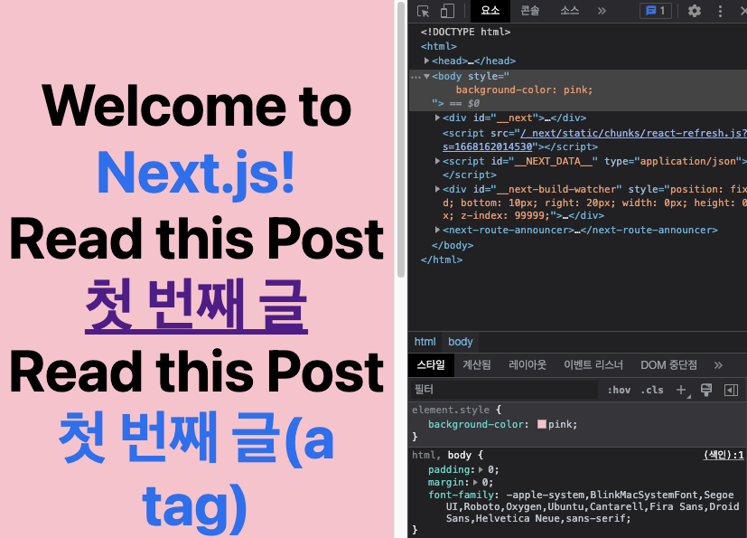

# Part2 Practice : 블로그 프로젝트

> [Next.js 제공 블로그 예제](https://next-learn-starter.vercel.app/)

위 예제를 바탕으로 블로그를 만들고(메인/상세 페이지 구성), 커스텀, 배포 과정까지 진행할 것이다.

---

## **01 프로젝트 시작**

이전에는 npx로 프로젝트를 만들었다면, 이번 프로젝트는 yarn으로 만들 것이다.

```bash
yarn create next-app blog --example "https://github.com/vercel/next-learn/tree/master/basics/learn-starter"
```

터미널에 입력했다면 [blog] 디렉터리에 프로젝트가 생성된다. 아래는 yarn dev로 실행한 화면이다.


기존 프로젝트들과 마찬가지로 prettier 설정을 진행했다.(.prettierrc, .prettierignore은 commerce와 동일하게 설정했다. Part01,02 README 참조)

### Page 만들기

다음과 같은 경로로 만들 것이다. [pages] 디렉터리 내 [post] 폴더를 만들고 내부에 first-post.js 파일을 간단하게 구성했다.

- pages/posts/first-post.js

```JavaScript
// first-post.js
export default function FirstPost() {
  return <h1>첫 번째 글</h1>
}
```

아래는 http://localhost:3000/posts/first-post 접속한 결과이다.


이 페이지를 처음 화면과 연결할 것이다.

```JavaScript
// ...
import Link from 'next/link'

// ...

      <main>
        <h1 className="title">
          Welcome to <a href="https://nextjs.org">Next.js!</a>
        </h1>

        <h1 className="title">
          <Link href="/posts/first-post"> Read this Post</Link>
        </h1>

        <h1 className="title">
          Read this Post <a href="/posts/first-post">첫 번째 글(a tag)</a>
        </h1>
```

이렇게 연결은 끝났다.

### Link Component

겸사겸사 Link 태그와 a 태그를 비교하기 위해 위와 같이 구성했다. Link 태그를 눌렀을 때와 a 태그를 눌렀을 때 반응을 개발자 도구를 통해 비교할 것이다. 비교를 위해 preserve log(로그 보존) 박스에 체크를 했다. 우선 command + shift + R로 강력 새로고침을 했을 때의 사진이다.


이제 Link 태그와 a 태그를 차례로 눌렀다.


Link 태그는 first-post.js 파일을 받아 왔다. Link 태그의 방식을 **Client Side Navigate**라고 한다. browser에 직접 url을 입력해서 이동하는 것과 달리, JS 상에서 page 컴포넌트를 교체한다.


반면 a 태그는 기존에 받은 모든 것을 포함해서 다시 받아왔다. 이처럼 a 태그는 주소창에 아예 새롭게 url을 다시 입력해서 접속한 것과 마찬가지다. 따라서 어떠한 최적화 효과도 적용되지 않는다.

### Code Splitting

이런 성질을 다른 방법으로 확인하기 위해서, 개발자 도구를 이용하여 background-color를 body에 주었다. navigate 했을 때 이 속성이 유지되는지 확인할 것이다.



Link 태그를 누르면 이 속성이 유지가 된다. 모든 데이터를 다시 불러온 것이 아닌, 특정 자바스크립트만 불러왔기 때문이다.


반면 a 태그를 누르면 작성한 속성이 사라진다. 리로드됐기 때문에 다시 홈으로 돌아오면 홈에서도 속성이 사라진다.


이처럼 Next.js는 Automatic Code Splitting을 제공한다.

- 특정 페이지에 접근할 때는 해당 페이지를 그릴 때 **필요한** chunk만 로드한다.

- 페이지 이동을 할 땐 **목적지 페이지에 필요한** chunk만 추가 로드한다.

이를 통해 성능이 **최적화**된다.

### Prefetching

\<Link\> 컴포넌트를 이용하면, Viewport에 Link 컴포넌트가 노출되었을 때, href로 연결된 페이지의 chunk를 로드한다.

이 기능을 확인하기 위해 [pages] - [posts] 디렉터리에 두 번째 페이지를 만들고(second-post.js), \<main\> 태그가 끝나는 지점에 Link 태그를 추가해서 연결했다.

```JavaScript
// index.js
      </main>

      <Link href="/posts/second-post">두 번째 글</Link>

      <footer>
```

확인을 위해 dev 모드가 아닌, yarn build - start 과정을 거쳤다.

홈 화면의 상단을 봤을 때 불러온 네트워크 파일에 주목하자.


이제 스크롤을 내려서 footer 위쪽에 있는 두 번째 글 링크를 보자.


스크롤을 내려서 링크를 확인하자 Link 컴포넌트에 연결된 페이지를 미리 가져왔다. 이처럼 노출되는 순간에 그 목적지 페이지의 chunk를 가져오는 것이다. 이 점도 Next.js가 최적화를 해 주는 부분이다.

### Link Component 부연 설명

- 현재 제공하는 서비스와 별개의 외부 링크로 연결할 때는 a tag만 쓰면 된다.

- Link Component에 스타일을 줄 때는 child tag로 만든 a tag에 줘야 했지만, Next.js 13부터 \<\Link id="link"\>Home\</\Link\>처럼 Link Component 자체에 스타일을 줄 수 있게 됐다.(아예 역할이 편입되었기 때문에, child tag로 a 태그를 주려는 시도 자체가 오류를 불러 온다.)

> [Creating Linkable Tabs in Next.js](https://dev.to/amrtcrypto/creating-linkable-tabs-in-nextjs-the-easy-way-17pg)

> 오류가 발생한다면 아래 명령을 이용해 next/link를 업그레이드한다.

```bash
npx @next/codemod new-link .
```

Link 태그가 있는 '첫 번째 글' 부분에 '글로벌'로 스타일을 부여한다.

```JavaScript
// index.js
//...
        <h1 className="title">
          Read this Post{' '}
          <Link href="/posts/first-post" className="href">
            첫 번째 글
          </Link>
        </h1>

// ...

      <style jsx global>{`
        .href {
          color: pink;
        }

        html,
        body {
          padding: 0;
          margin: 0;
          font-family: -apple-system, BlinkMacSystemFont, Segoe UI, Roboto,
            Oxygen, Ubuntu, Cantarell, Fira Sans, Droid Sans, Helvetica Neue,
            sans-serif;
        }

        * {
          box-sizing: border-box;
        }
      `}</style>
//...
```

그러면 다음과 같이 스타일이 적용된다.


---
