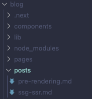

# Part2 Practice : 블로그 프로젝트

> [Next.js 제공 블로그 예제](https://next-learn-starter.vercel.app/)

위 예제를 바탕으로 블로그를 만들고(메인/상세 페이지 구성), 커스텀, 배포 과정까지 진행할 것이다.

공식 문서에서는 layout.js를 사용하지만, 예제에서는 Layout.js 파일로 생성한 만큼 프로젝트 진행에 유의할 것.(한 차례 오류 발생)

---

## **01 프로젝트 시작(Link Component / Client-Side Naivgation)**

이전에는 npx로 프로젝트를 만들었다면, 이번 프로젝트는 yarn으로 만들 것이다.

```bash
yarn create next-app blog --example "https://github.com/vercel/next-learn/tree/master/basics/learn-starter"
```

터미널에 입력했다면 [blog] 디렉터리에 프로젝트가 생성된다. 아래는 yarn dev로 실행한 화면이다.


기존 프로젝트들과 마찬가지로 prettier 설정을 진행했다.(.prettierrc, .prettierignore은 commerce와 동일하게 설정했다. Part01,02 README 참조)

### Page 만들기

다음과 같은 경로로 만들 것이다. [pages] 디렉터리 내 [post] 폴더를 만들고 내부에 first-post.js 파일을 간단하게 구성했다.

- pages/posts/first-post.js

```JavaScript
// first-post.js
export default function FirstPost() {
  return <h1>첫 번째 글</h1>
}
```

아래는 http://localhost:3000/posts/first-post 접속한 결과이다.


이 페이지를 처음 화면과 연결할 것이다.

```JavaScript
// ...
import Link from 'next/link'

// ...

      <main>
        <h1 className="title">
          Welcome to <a href="https://nextjs.org">Next.js!</a>
        </h1>

        <h1 className="title">
          <Link href="/posts/first-post"> Read this Post</Link>
        </h1>

        <h1 className="title">
          Read this Post <a href="/posts/first-post">첫 번째 글(a tag)</a>
        </h1>
```

이렇게 연결은 끝났다.

### Link Component

겸사겸사 Link 태그와 a 태그를 비교하기 위해 위와 같이 구성했다. Link 태그를 눌렀을 때와 a 태그를 눌렀을 때 반응을 개발자 도구를 통해 비교할 것이다. 비교를 위해 preserve log(로그 보존) 박스에 체크를 했다. 우선 command + shift + R로 강력 새로고침을 했을 때의 사진이다.


이제 Link 태그와 a 태그를 차례로 눌렀다.


Link 태그는 first-post.js 파일을 받아 왔다. Link 태그의 방식을 **Client Side Navigate**라고 한다. browser에 직접 url을 입력해서 이동하는 것과 달리, JS 상에서 page 컴포넌트를 교체한다.


반면 a 태그는 기존에 받은 모든 것을 포함해서 다시 받아왔다. 이처럼 a 태그는 주소창에 아예 새롭게 url을 다시 입력해서 접속한 것과 마찬가지다. 따라서 어떠한 최적화 효과도 적용되지 않는다.

### Code Splitting

이런 성질을 다른 방법으로 확인하기 위해서, 개발자 도구를 이용하여 background-color를 body에 주었다. navigate 했을 때 이 속성이 유지되는지 확인할 것이다.


Link 태그를 누르면 이 속성이 유지가 된다. 모든 데이터를 다시 불러온 것이 아닌, 특정 자바스크립트만 불러왔기 때문이다.


반면 a 태그를 누르면 작성한 속성이 사라진다. 리로드됐기 때문에 다시 홈으로 돌아오면 홈에서도 속성이 사라진다.


이처럼 Next.js는 Automatic Code Splitting을 제공한다.

- 특정 페이지에 접근할 때는 해당 페이지를 그릴 때 **필요한** chunk만 로드한다.

- 페이지 이동을 할 땐 **목적지 페이지에 필요한** chunk만 추가 로드한다.

이를 통해 성능이 **최적화**된다.

### Prefetching

\<Link\> 컴포넌트를 이용하면, Viewport에 Link 컴포넌트가 노출되었을 때, href로 연결된 페이지의 chunk를 로드한다.

이 기능을 확인하기 위해 [pages] - [posts] 디렉터리에 두 번째 페이지를 만들고(second-post.js), \<main\> 태그가 끝나는 지점에 Link 태그를 추가해서 연결했다.

```JavaScript
// index.js
      </main>

      <Link href="/posts/second-post">두 번째 글</Link>

      <footer>
```

확인을 위해 dev 모드가 아닌, yarn build - start 과정을 거쳤다.

홈 화면의 상단을 봤을 때 불러온 네트워크 파일에 주목하자.


이제 스크롤을 내려서 footer 위쪽에 있는 두 번째 글 링크를 보자.


스크롤을 내려서 링크를 확인하자 Link 컴포넌트에 연결된 페이지를 미리 가져왔다. 이처럼 노출되는 순간에 그 목적지 페이지의 chunk를 가져오는 것이다. 이 점도 Next.js가 최적화를 해 주는 부분이다.

### Link Component 부연 설명

- 현재 제공하는 서비스와 별개의 외부 링크로 연결할 때는 a tag만 쓰면 된다.

- 과거 Link Component에 스타일을 줄 때는 child tag로 만든 a tag에 줘야 했지만, Next.js 13부터 \<\Link id="link"\>Home\</\Link\>처럼 Link Component 자체에 스타일을 줄 수 있게 됐다.(아예 역할이 편입되었기 때문에, child tag로 a 태그를 주려는 시도 자체가 오류를 불러 온다.)

> [Creating Linkable Tabs in Next.js](https://dev.to/amrtcrypto/creating-linkable-tabs-in-nextjs-the-easy-way-17pg)

> 오류가 발생한다면 아래 명령을 이용해 next/link를 업그레이드한다.

```bash
npx @next/codemod new-link .
```

className으로 속성을 추가하고, Link 태그가 있는 '첫 번째 글' 부분에 '글로벌'로 스타일을 부여한다.

```JavaScript
// index.js
//...
        <h1 className="title">
          Read this Post{' '}
          <Link href="/posts/first-post" className="href">
            첫 번째 글
          </Link>
        </h1>

// ...

      <style jsx global>{`
        .href {
          color: pink;
        }

        html,
        body {
          padding: 0;
          margin: 0;
          font-family: -apple-system, BlinkMacSystemFont, Segoe UI, Roboto,
            Oxygen, Ubuntu, Cantarell, Fira Sans, Droid Sans, Helvetica Neue,
            sans-serif;
        }

        * {
          box-sizing: border-box;
        }
      `}</style>
//...
```

그러면 다음과 같이 스타일이 적용된다.


---

## **02 Layouts / Styling**

Link 태그와 a 태그를 비교하기 위해 작성한 부분(a 태그)를 제거하고, Welcome to Next.js! 단락도 제거했다.

### public

[public]은 정적 리소스를 Next.js로 서빙하기 위한 디렉터리다.

- robots.txt: 크롤러의 권한을 정의한 파일(예시: https://www.reddit.com/robots.txt)

- images

### Image Component

Link 태그와 a 태그의 관계처럼, 이미지도 Image 태그(Next.js 제공)와 img 태그가 있다.

```JavaScript
// img 태그

```

```JavaScript
// Image 태그
<Image src="/images/profile.png" width={144} height={144} alt="Holography">
```

차이를 확인하기 위해 현재 프로젝트의 [public] 디렉터리에 [images] 폴더를 만들고 내부에 profile.png 파일을 넣었다.


우선 img 태그를 이용하여 상단에 표시해 보았다.

```JavaScript
// index.js
// ...
      <main>
        

        <h1 className="title">
          Read this Post{' '}
          //...
```

다음과 같이 표시된다. 개발자 도구 이미지 탭을 보면 profile.png를 가져온 것을 알 수 있다.


이번에는 Image 태그로 표시할 것이다. (img 태그로 표시한 것은 주석 처리했다.) 이를 위해 import Image from 'next/image' 과정을 거쳤다.

```JavaScript
//...
import Image from 'next/image'

//...
      <main>
        {/* 주석 처리*/}
        <Image
          src="/images/profile.png"
          alt="holography"
          width={140}
          height={140}
        />
```

이렇게 Image 태그로 생성된 이미지는 img 태그로 불러온 이미지와 다른 형태로 가져오는 것을 알 수 있다.


먼저 요청 url이 다음과 같다.

```
http://localhost:3000/_next/image?url=%2Fimages%2Fprofile.png&w=256&q=75
```


또한 우측 하단을 보면 불러온 이미지가 훨씬 가벼운 webp 형식인 것을 알 수 있다.(사용자의 브라우저에 맞춰서 최적화된 포맷으로 제공한다.)

또한 Prefetching도 적용된다. 예를 들어 상단에 있는 Image 태그를 하단으로 옮기면, 이미지가 viewport에 들어올 때 로드된다.(lazy load한다.)

다시 정리하면 다음과 같은 기능을 제공한다.

- Resizing(responsive 사이즈)

- Lazy load(viewport에 들어오면 로드)

- 그외 optimization(webp 형태)

또한 CLS(Cumulative Layout Shift, 누적 레이아웃 이동)를 최대한 방지한다. CLS는 컴포넌트가 없다가 생기거나, 컴포넌트의 사이즈가 바뀌면서, 다른 컴포넌트 요소들이 다시 렌더되는(layout shifting 되는) 현상을 말한다.

### Metadata

웹 문서로서 제공하는 메타 정보들을 의미한다.

개발자 도구를 보면 쉽게 확인할 수 있다. '\<title> 제목 \</title>' 내부에 들어 있다. 직접 사이트를 확인해 보자.(https://www.google.com/search?q=react)


잘 보면 메타 정보 그대로 구글에 노출되고 있다. 구글 검색 엔진이 사이트를 크롤링하면서 이런 정보를 수집해서 표시하는 것이다.

지금 만드는 프로젝트도 잘 보면 이미 이 부분을 포함하고 있다.

```JavaScript
// index.js

export default function Home() {
  return (
    <div className="container">
      <Head>
        <title>Create Next App</title>
        <link rel="icon" href="/favicon.ico" />
      </Head>
```

아래와 같은 다양한 컴포넌트를 포함할 수 있다.

Head Component

- title / images / description 등 og(open graph) tag: 예를 들어 카카오톡에 링크를 공유하면 사이트의 대표 이미지와 타이틀, 묘사 등이 표시된다.

- icon

- third party script(ex. google-analytics..)

Script Component

- strategy

- onLoad

### Layout

레이아웃 예시로 공통 컴포넌트로 ./layout.module.css라는 CSS 모듈을 만들 것이다.

.container 클래스 스타일을 만들고, Layout에서 해당 클래스네임을 사용하면 css가 적용된다.

프로젝트에 [components] 디렉터리를 만들고 내부에 Layout.js 파일, layout.module.css 파일을 생성했다. Layout.js 파일은 {children}을 받아 div로 감싸서 반환한다. 동시에 css 파일의 .container에서 코드를 꺼내서 주입해 준다.

layout.module.css 파일 코드는 다음과 같다.

```css
.container {
  max-width: 36rem;
  padding: 0 1rem;
  margin: 3rem auto 6rem;
}
```

Layout.js 파일 코드는 다음과 같다.

```JavaScript
import styles from './layout.module.css'

export default function Layout({ children }) {
  return <div className={styles.container}>{children}</div>
}
```

이제 first-post 페이지에 레이아웃을 적용해 보자. 우선 겸사겸사 메타데이터를 추가하였다.

```JavaScript
// first-post.js

import Head from 'next/head'

export default function FirstPost() {
  return (
    <>
      <Head>
        <title>첫 번째 글</title>
      </Head>
      <h1>첫 번째 글</h1>
    </>
  )
}
```


그 다음 레이아웃을 추가했다.

```JavaScript
// first-post.js

import Head from 'next/head'
import Layout from '../../components/Layout'

export default function FirstPost() {
  return (
    <Layout>
      <Head>
        <title>첫 번째 글</title>
      </Head>
      <h1>첫 번째 글</h1>
    </Layout>
  )
}
```


### Global CSS

예제로 pages/\_app.js 파일을 만들었다. styles/global.css를 만들어서 전역으로 적용할 스타일을 정의하고, \_app.js 에서 import '../styles/global.css'를 할 것이다.([style] 디렉터리 생성 후 global.css 파일을 생성했다. 또한 [pages] 디렉터리 안에 \_app.js 파일을 생성했다.)

> [Nextjs.org: Global styles](https://nextjs.org/learn/basics/assets-metadata-css/global-styles)

공식 홈페이지에 있는 global CSS 파일 코드 안내에 따라 파일을 생성할 것이다. 아래는

```css
html,
body {
  padding: 0;
  margin: 0;
  font-family: -apple-system, BlinkMacSystemFont, Segoe UI, Roboto, Oxygen, Ubuntu, Cantarell, Fira Sans, Droid Sans, Helvetica
      Neue, sans-serif;
  line-height: 1.6;
  font-size: 18px;
}

* {
  box-sizing: border-box;
}

a {
  color: #0070f3;
  text-decoration: none;
}

a:hover {
  text-decoration: underline;
}

img {
  max-width: 100%;
  display: block;
}
```

global.css 파일 생성이 끝났다. 이번에는 [pages] 디렉터리 안에 생성한 \_app.js 파일 코드이다. (Part2 Layout 문단 참조)

```JavaScript
// _app.js
import '../styles/global.css'

export default function App({ Component, pageProps }) {
  return <Component {...pageProps} />
}
```

아래는 적용 전과 적용 후 사진이다.

- 적용 전


- 적용 후


### 스타일 추가

[Next.js: Assets, Metadata, and CSS](https://nextjs.org/learn/basics/assets-metadata-css/polishing-layout)

위 공식 사이트에서 제시한 스타일로 만들어 볼 것이다. 사이트에서 소개한 차례대로 진행했다.

아래는 layout.module.css 파일이다.

```css
.container {
  max-width: 36rem;
  padding: 0 1rem;
  margin: 3rem auto 6rem;
}

.header {
  display: flex;
  flex-direction: column;
  align-items: center;
}

.backToHome {
  margin: 3rem 0 0;
}
```

다음은 [styles] 디렉터리 내 utils.module.css 파일을 만든 뒤 넣은 코드다.

```css
.heading2Xl {
  font-size: 2.5rem;
  line-height: 1.2;
  font-weight: 800;
  letter-spacing: -0.05rem;
  margin: 1rem 0;
}

.headingXl {
  font-size: 2rem;
  line-height: 1.3;
  font-weight: 800;
  letter-spacing: -0.05rem;
  margin: 1rem 0;
}

.headingLg {
  font-size: 1.5rem;
  line-height: 1.4;
  margin: 1rem 0;
}

.headingMd {
  font-size: 1.2rem;
  line-height: 1.5;
}

.borderCircle {
  border-radius: 9999px;
}

.colorInherit {
  color: inherit;
}

.padding1px {
  padding-top: 1px;
}

.list {
  list-style: none;
  padding: 0;
  margin: 0;
}

.listItem {
  margin: 0 0 1.25rem;
}

.lightText {
  color: #666;
}
```

다음으로 [components] 내부에 있는 Layout.js 파일 코드를 바꾸어 주었다.(홈페이지 예시는 layout.js로 소문자로 만들어 두었다. profile.jpg는 확장자를 png로 바꿨다.)

```JavaScript
import Head from 'next/head'
import Image from 'next/image'
import styles from './layout.module.css'
import utilStyles from '../styles/utils.module.css'
import Link from 'next/link'

const name = 'Your Name'
export const siteTitle = 'Next.js Sample Website'

export default function Layout({ children, home }) {
  return (
    <div className={styles.container}>
      <Head>
        <link rel="icon" href="/favicon.ico" />
        <meta
          name="description"
          content="Learn how to build a personal website using Next.js"
        />
        <meta
          property="og:image"
          content={`https://og-image.vercel.app/${encodeURI(
            siteTitle
          )}.png?theme=light&md=0&fontSize=75px&images=https%3A%2F%2Fassets.vercel.com%2Fimage%2Fupload%2Ffront%2Fassets%2Fdesign%2Fnextjs-black-logo.svg`}
        />
        <meta name="og:title" content={siteTitle} />
        <meta name="twitter:card" content="summary_large_image" />
      </Head>
      <header className={styles.header}>
        {home ? (
          <>
            <Image
              priority
              src="/images/profile.png"
              className={utilStyles.borderCircle}
              height={144}
              width={144}
              alt=""
            />
            <h1 className={utilStyles.heading2Xl}>{name}</h1>
          </>
        ) : (
          <>
            <Link href="/">
              <Image
                priority
                src="/images/profile.png"
                className={utilStyles.borderCircle}
                height={108}
                width={108}
                alt=""
              />
            </Link>
            <h2 className={utilStyles.headingLg}>
              <Link href="/" className={utilStyles.colorInherit}>
                {name}
              </Link>
            </h2>
          </>
        )}
      </header>
      <main>{children}</main>
      {!home && (
        <div className={styles.backToHome}>
          <Link href="/">← Back to home</Link>
        </div>
      )}
    </div>
  )
}

```

그 다음으로는 [pages] 디렉터리 내 index.js 파일 코드를 바꾸어 주었다.

```JavaScript
// index.js

import Head from 'next/head';
import Layout, { siteTitle } from '../components/Layout';
import utilStyles from '../styles/utils.module.css';

export default function Home() {
  return (
    <Layout home>
      <Head>
        <title>{siteTitle}</title>
      </Head>
      <section className={utilStyles.headingMd}>
        <p>[Your Self Introduction]</p>
        <p>
          (This is a sample website - you’ll be building a site like this on{' '}
          <a href="https://nextjs.org/learn">our Next.js tutorial</a>.)
        </p>
      </section>
    </Layout>
  );
}
```

그럼 다음과 같이 레이아웃이 바뀐 것을 볼 수 있다.


---

## **03 Pre-rendering / Data Fetching**

SSG(build time) vs SSR(request time)을 블로그 예제를 만들면서 다시 한 번 확인해 보자.

이미 Next.js를 활용하면 페이지별로 Pre-rendering 방식을 선택할 수 있다는 사실을 공부했다. 예를 들어 getStaticProps를 사용하면 SSG, getServerSideProps를 사용하면 SSR이었다.

SSG의 적용 여부를 선택하는 기준은 '사용자가 페이지를 **요청하기 전**에 pre-render할 수 있는가?'로 판단할 수 있다. 예를 들면 Marketing pages, blog posts, e-commerce product listings, help and documentation 등이 있다.

SSG는 2가지 케이스가 있었다.

- 외부 데이터 없이 pre-rendering

- 외부 데이터를 가져와서 pre-rendering

여기서 외부 데이터란 아래와 같은 요소들을 의미했다.

- 다른 파일

- API

- DB 등

다른 파일을 읽어올 것이다. 두 가지 md 파일(posts/pre-rendering.md, posts/ssg-ssr.md)을 읽을 것이며, 아래 Next.js 공식 홈페이지에서 제시하고 있다.

> [Next.js: 예제 md 파일](https://nextjs.org/learn/basics/data-fetching/blog-data)

[pages] 디렉터리 하위에 있는 [posts] 폴더가 아닌, 프로젝트 최상위에 [posts] 폴더를 만들어서 내부에 md 파일을 생성했다.

아래는 posts/pre-rendering.md 파일 코드다.

```md
---
title: "Two Forms of Pre-rendering"
date: "2020-01-01"
---

Next.js has two forms of pre-rendering: **Static Generation** and **Server-side Rendering**. The difference is in **when** it generates the HTML for a page.

- **Static Generation** is the pre-rendering method that generates the HTML at **build time**. The pre-rendered HTML is then _reused_ on each request.
- **Server-side Rendering** is the pre-rendering method that generates the HTML on **each request**.

Importantly, Next.js let's you **choose** which pre-rendering form to use for each page. You can create a "hybrid" Next.js app by using Static Generation for most pages and using Server-side Rendering for others.
```

다음은 posts/ssg-ssr.md 파일 코드다.

```md
---
title: "When to Use Static Generation v.s. Server-side Rendering"
date: "2020-01-02"
---

We recommend using **Static Generation** (with and without data) whenever possible because your page can be built once and served by CDN, which makes it much faster than having a server render the page on every request.

You can use Static Generation for many types of pages, including:

- Marketing pages
- Blog posts
- E-commerce product listings
- Help and documentation

You should ask yourself: "Can I pre-render this page **ahead** of a user's request?" If the answer is yes, then you should choose Static Generation.

On the other hand, Static Generation is **not** a good idea if you cannot pre-render a page ahead of a user's request. Maybe your page shows frequently updated data, and the page content changes on every request.

In that case, you can use **Server-Side Rendering**. It will be slower, but the pre-rendered page will always be up-to-date. Or you can skip pre-rendering and use client-side JavaScript to populate data.
```

우선 \---로 감싸진 metadata(YAML Front Matter)를 읽어보자

이를 위해 front matter를 해석해 줄 라이브러리를 설치해야 한다.

```bash
npm install gray-matter
```

설치를 마친 뒤 gray-matter를 활용하는 코드를 만든다.(프로젝트 최상단 [lib] 디렉터리를 생성 뒤, posts.js 파일)

```JavaScript
// posts.js
import fs from 'fs';
import path from 'path';
import matter from 'gray-matter';

const postsDirectory = path.join(process.cwd(), 'posts');

export function getSortedPostsData() {
  // Get file names under /posts
  const fileNames = fs.readdirSync(postsDirectory);
  const allPostsData = fileNames.map((fileName) => {
    // Remove ".md" from file name to get id
    const id = fileName.replace(/\.md$/, '');

    // Read markdown file as string
    const fullPath = path.join(postsDirectory, fileName);
    const fileContents = fs.readFileSync(fullPath, 'utf8');

    // Use gray-matter to parse the post metadata section
    const matterResult = matter(fileContents);

    // Combine the data with the id
    return {
      id,
      ...matterResult.data,
    };
  });
  // Sort posts by date
  return allPostsData.sort(({ date: a }, { date: b }) => {
    if (a < b) {
      return 1;
    } else if (a > b) {
      return -1;
    } else {
      return 0;
    }
  });
}
```

코드를 차근차근 살펴 보자. getSortedPostsData() 함수가 posts 데이터를 읽는다. 읽는 디렉터리는 postsDirectory 상수로 지정한 곳인데, 즉 path.join() 함수를 살펴 보면 어디를 가리키는지 알 수 있다. 우선 첫 번째 인자인 process.cwd()는 현재 서비스의 root를 의미한다.(예제는 [blog]가 된다.). 그리고 두 번째 인자로 posts가 붙었으므로 md 파일이 든 [blog] - [posts] 디렉터리를 의미한다.

```JavaScript
const postsDirectory = path.join(process.cwd(), 'posts');

export function getSortedPostsData() {
  // /posts 디렉터리에 있는 파일 네임들을 읽어온다.
  const fileNames = fs.readdirSync(postsDirectory);
  //...
```



이렇게 파일 이름을 읽었다면, 이제 fs.readdirSync의 map 함수를 통해(fs: file system. 파일을 읽어오는 Node.js의 라이브러리), 읽어온 파일 제목에서 .md 부분을 제거한 부분만 id에 저장한다.

```JavaScript
  const allPostsData = fileNames.map((fileName) => {
    // Remove ".md" from file name to get id
    const id = fileName.replace(/\.md$/, '');
```

이제 md 파일의 경로에 해당하는 fullPath 상수를 만들고, fs.readFileSync로 md 파일을 문자열로 읽는다.

```JavaScript
    // Read markdown file as string
    const fullPath = path.join(postsDirectory, fileName);
    const fileContents = fs.readFileSync(fullPath, 'utf8');
```

이제 ---로 감싸진 부분만 읽기 위해 gray-matter를 이용한다. 결과는 metadata만 읽어낸다.

```JavaScript
    // Use gray-matter to parse the post metadata section
    const matterResult = matter(fileContents);
```

이후 값들을 반환한다. id는 .md를 제외한 파일명이 있었고, matterResult에는 ---로 감싸진 metadata가 저장되어 있었다.

allPostsData.sort에서는 id 파일 내 있는 date 값을 꺼내서, 조건에 따라 값을 반환한다.

> [mdn: sort() 메서드](https://developer.mozilla.org/ko/docs/Web/JavaScript/Reference/Global_Objects/Array/sort): 정렬 순서에 따라 어떤 값을 반환하는지 안내

```JavaScript
    // Combine the data with the id
    return {
      id,
      ...matterResult.data,
    };
  });
  // Sort posts by date
  return allPostsData.sort(({ date: a }, { date: b }) => {
    if (a < b) {
      return 1;
    } else if (a > b) {
      return -1;
    } else {
      return 0;
    }
  });
}
```

### SSG로 구현

> [Next.js: getStaticProps](https://nextjs.org/learn/basics/data-fetching/implement-getstaticprops)

우선 SSG로 구현할 것이다. 이를 위해 getStaticProps()(+ getStaticPaths())를 사용해야 한다. [pages] - index.js 파일에 예제에서 제시한 방식대로 구현해 보자.(링크 내 section 파트를 넣어 주었다.)

```JavaScript
// index.js
import Head from 'next/head'
import Layout, { siteTitle } from '../components/Layout'
import { getSortedPostsData } from '../lib/posts'    // getSortedPostsData() 함수를 가져온다.
import utilStyles from '../styles/utils.module.css'

// 위에서 구현한 getSortedPostsData() 함수로 데이터를 받아온다. 이를 밑에 전달할 것이다.
export async function getStaticProps() {
  const allPostsData = getSortedPostsData()

  return {
    props: {
      allPostsData,
    },
  }
}

export default function Home({ allPostsData }) {
  return (
    <Layout home>
      <Head>
        <title>{siteTitle}</title>
      </Head>
      <section className={utilStyles.headingMd}>
        <p>[Your Self Introduction]</p>
        <p>
          (This is a sample website - you’ll be building a site like this on{' '}
          <a href="https://nextjs.org/learn">our Next.js tutorial</a>.)
        </p>
      </section>

      // 공식 문서에서 제공하는 section 부분
      <section className={`${utilStyles.headingMd} ${utilStyles.padding1px}`}>
        <h2 className={utilStyles.headingLg}>Blog</h2>
        <ul className={utilStyles.list}>
          {allPostsData.map(({ id, date, title }) => (
            <li className={utilStyles.listItem} key={id}>
              {title}
              <br />
              {id}
              <br />
              {date}
            </li>
          ))}
        </ul>
      </section>
    </Layout>
  )
}
```

map() 메서드로 {id, date, title}을 받아서, id를 key로 쓰고, title와 id, date를 순서대로 노출시킨다.

아래는 yarn build - start로 실행한 홈페이지 결과 사진이다.


### SSR로 구현

이번에는 SSR로 구현하자. 따라서 getServerSideProps()를 사용한다.

```JavaScript
// index.js

export async function getServerSideProps() {
  const allPostsData = getSortedPostsData()
  //...
}
```

이번 예제는 단순히 함수 이름만 getServerSideProps()로 바꿔 주면 끝이다.


### CSR로 구현

이번에는 CSR로 구현할 것이다. 함수를 지워 주기만 하면 작동할까? 정답은 '그렇지 않다'이다.

지금 예제는 홈페이지는 서버(노드)에서 파일을 읽어와서, SSG와 SSR로 구현할 때는 함수가 이것을 받아서 전달했다. 따라서 서버를 쓰는 또 다른 방식: API Routes를 적용해야 한다.

res이 오면 res.json으로 바꿔 주며, data가 오면 setAllPostsData(data)를 반환한다.

이제 api를 만든다. [pages] 디렉터리 내 [api] 폴더를 만든 뒤, 내부에 posts.js를 만들었다.

```JavaScript
// api/posts.js
import { getSortedPostsData } from '../../lib/posts'

export default function handler(req, res) {
  const allPostsData = getSortedPostsData()
  res.status(200).json({ allPostsData })
}
```

다음은 수정한 index.js 파일 코드이다.

```JavaScript
// index.js
import Head from 'next/head'
import { useEffect, useState } from 'react'
import Layout, { siteTitle } from '../components/Layout'
// import { getSortedPostsData } from '../lib/posts'
import utilStyles from '../styles/utils.module.css'

export default function Home() {
  const [allPostsData, setAllPostsData] = useState([])
  useEffect(() => {
    fetch('api/posts')
      .then((res) => res.json())
      .then((data) => setAllPostsData(data.allPostsData))
  }, [])
  return (
    //...
  )
}
```

아래는 CSR로 구현한 홈페이지 사진이다. 클라이언트 사이드에서 요청했기 때문에, 클라이언트 네트워크 탭에 파일 시스템에서 읽은 값들이 표시된다.


### SSG + API 구현

그렇다면 SSG의 getStaticProps()에서 API를 직접 호출하면 어떻게 될까?

> [Next.js: Using getStaticProps to fetch data from a CMS](https://nextjs.org/docs/basic-features/data-fetching/get-static-props#write-server-side-code-directly)(CMS란 콘텐츠 관리 시스템을 뜻한다. 워드프레스가 예시)

```JavaScript
// index.js
import Head from 'next/head'
import Layout, { siteTitle } from '../components/Layout'
import utilStyles from '../styles/utils.module.css'


export async function getStaticProps() {
  // getStaticProps에서는 fetch를 절대 경로만 사용할 수 있다.
  // Call an external API endpoint to get posts
  const response = await fetch('http://localhost:3000/api/posts')
  const json = await response.json()

  // By returning { props: { allPostsData: { json.allPostsData, }, }
  // will receive `allPostsData` as a prop at build time
  return {
    props: {
      allPostsData: json.allPostsData,
    },
  }
}

export default function Home({ allPostsData }) {
  return (
    //...
  )
}
```

아래는 yarn dev로 구동한 화면이다.


### Data를 가져오는 함수 getSortedPostsData의 확장

- 다른 File 조회

- 외부 api 요청

- DB 조회

---
