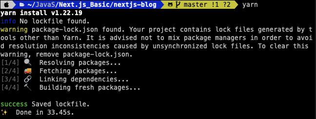
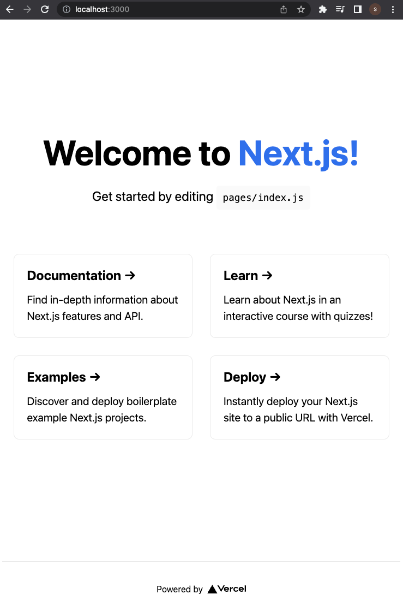
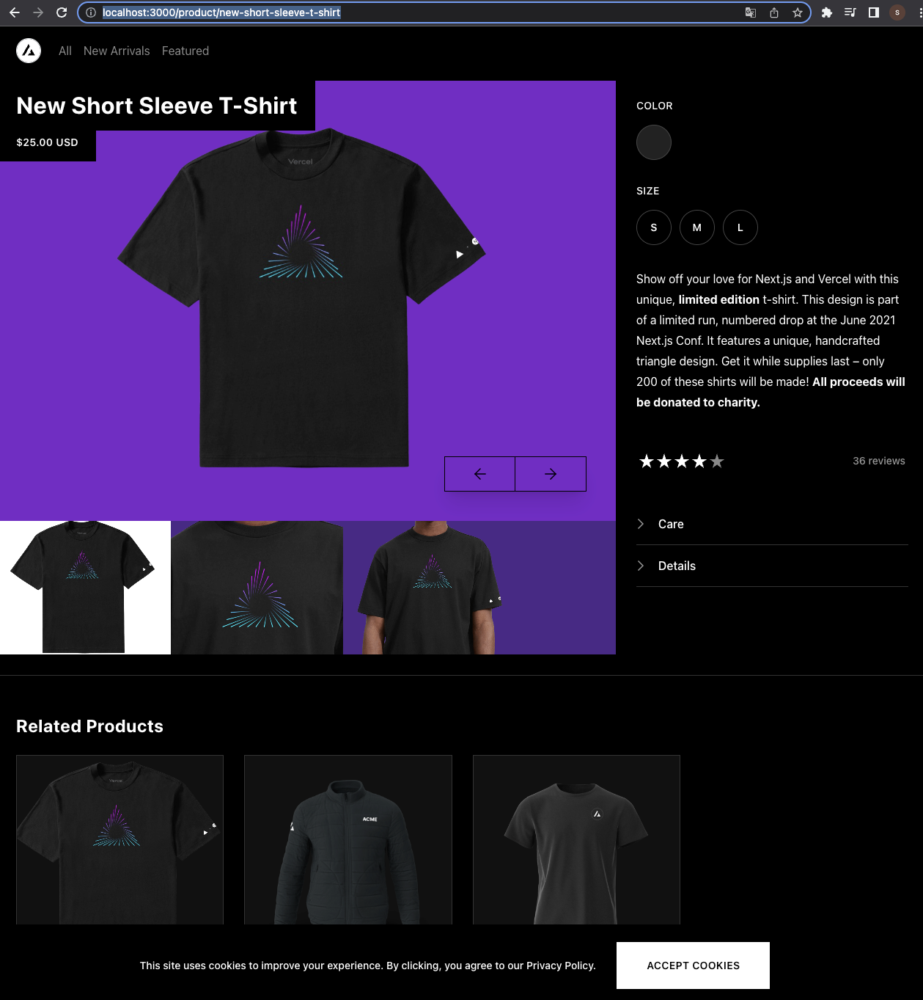

# Next.js 개념 소개

- 실습 환경

  > next12.1.6 버전을 베이스로 한 강의로 'npm install next@12.1.6'를 이용해서 하위 버전으로 프로젝트를 진행하였다.

  > 'npm install -g yarn': 패키지 매니저로 yarn을 설치했다.(-g: 글로벌 옵션)

  > 'yarn set version <수정할 버전>' 명령으로 강의 당시 버전인 1.22.17로 변경하여 진행했다. 'yarn --version' 명령으로 현재 버전을 확인할 수 있다.

  > VSCode Extension으로 React Snippets를 추가적으로 설치하였다.

---

## **01 Next.js 소개**

> [공식 문서](https://nextjs.org): Vercel에서 관리하는 Next.js 프레임워크에 대한 공식 홈페이지

간단한 소개로 다음과 같은 특징을 내세우고 있다. hybrid static & server rendering, TypeScript support, smart bundling, route pre-fetching, and more.

React는 자바스크립트 라이브러리를 표방하고 있는데, Next.js와 어떤 차이가 있는지를 알면 Next.js가 어떤 도구인지 이해하는 데 도움이 된다.

### 프레임워크 vs 라이브러리

- 프레임워크는 '기반구조' vs 라이브러리는 '개발 편의 도구'들

- 제어 주도권은 프레임워크가 갖는다 vs (라이브러리에서) 제어 주도권은 사용자가 갖는다

- 프레임워크는 '기계'(굴삭기) vs 라이브러리는 '공구'(니퍼)

- 프레임워크의 자유도는 작다 vs 라이브러리의 자유도는 상대적으로 크다

프레임워크는 특정 디자인 패턴이나 동작과 기능을 위한 정의나 방식을 먼저 정리해 두었다. 따라서 정해진 틀에 맞춰 협업하며 통일성을 갖출 수 있다.

### Next.js를 사용하는 이유

- 규모 있는 서비스 구조 설계를 위한 이점이 있다.

- 개발 환경 편의성 / 코드 분할을 처리해 줌 / 파일 기반 구조 등의 기능을 제공한다.

- SEO(검색 엔진 최적화): 사용자들이 서비스를 찾기 편리하게 된다.

- 간단한 API 구성에 용이하다.

- 편리한 Vercel 배포 시스템을 이용 가능

비슷한 React 프레임워크 대체제로는 Gatsby / Remix 등이 있다.

---

### learn-starter 프로젝트 살피기

```
npx create-next-app nextjs-blog --use-npm --example "https://github.com/vercel/next-learn/tree/master/basics/learn-starter"
```

디렉터리에서 터미널에 위와 같은 명령을 입력하면, Next.js에서 제공하는 learn-starter 프로젝트가 nextjs-blog 디렉터리에 설치된다.

아래는 package.json 파일 전문이다. Next.js 설치 시 package.json에는 scripts가 추가되게 된다.

```json
{
  "private": true,
  "scripts": {
    "dev": "next dev",
    "build": "next build",
    "start": "next start"
  },
  "dependencies": {
    "next": "latest",
    "react": "18.2.0",
    "react-dom": "18.2.0"
  }
}
```

이때 scripts 내부 요소 각각은 다음과 같은 의미를 갖는다.

- "dev": "next dev" - **개발 모드**에서 Next.js 를 시작하는 실행

- "build": "next build" - **프로덕션 용도**로 애플리케이션을 빌드하는 실행

- "start": "next start" - Next.js **프로덕션 서버**를 시작하는 실행

'npm run dev'를 터미널에 입력하면 나오는 주소(http://localhost:포트)로 프로젝트가 실행된 것을 확인할 수 있다.



터미널에서 [nextjs-blog] 디렉터리로 이동 후, 패키지 매니징을 yarn으로 하기 위해 'yarn'을 입력해 준다. 성공적으로 진행되면 yarn.lock 파일이 생성된다.

'npm run dev'와 마찬가지로 'yarn dev' 명령어로 프로젝트를 실행할 수 있다. (종료는 control + c)


아래는 실행 화면이다.



[pages] 디렉터리에 있는 index.js 파일을 수정해서 저장 시 반영되는 것을 볼 수 있다. [public] 디렉터리에 넣어둔 svg 파일은 'img src="/vercel.svg'처럼 바로 접근할 수 있다.

### commerce 프로젝트 살피기

[commerce 프로젝트 깃허브](https://github.com/vercel/commerce/tree/8398a962154a972d3af308ec48e01bebe5b92f7a): git clone 명령어를 이용하여 프로젝트를 복제한다. 7월 13일 기준 버전으로 선택했다.(이후 버전은 pnpm을 packageManager로 사용하므로 강의와 일치하지 않는다.) 클론한 디렉터리 [commerce]로 이동 후 git log로 커밋 로그를 확인한 뒤 특정 버전으로 롤백했다.

```
$ git clone https://github.com/vercel/commerce.git

$ git reset --hard 87134e2990c3ce666ec364d9c8714c0b252e8792
```

터미널에서 code commerce를 입력하면 VSCode가 추천 확장 기능을 표시한다.(extension.json 파일이 포함되어 있기 때문이다.) 이들을 설치하고, 터미널에서 yarn을 입력한다.

```json
{
  "name": "commerce",
  "license": "MIT",
  "private": true,
  "workspaces": ["site", "packages/*"],
  "scripts": {
    "build": "turbo run build --filter=next-commerce...",
    "dev": "turbo run dev",
    "start": "turbo run start",
    "types": "turbo run types",
    "prettier-fix": "prettier --write ."
  },
  "devDependencies": {
    "husky": "^7.0.4",
    "prettier": "^2.5.1",
    "turbo": "^1.2.16"
  },
  "husky": {
    "hooks": {
      "pre-commit": "turbo run lint"
    }
  },
  "packageManager": "yarn@1.22.17"
}
```

packages.json 파일을 보면 learn-starter 프로젝트와 모양이 꽤 다른 것을 알 수 있다.

프로젝트의 [site] 폴더가 learn-starter 프로젝트와 유사한 구조를 가지고 있는데, turbo가 이를 감싸주는 무언가로 이해하면 된다.

아래 명령을 통해 yarn build 입력 시 제시되는 오류 'The engine "node" is incompatible with this module. Expected version "12 - 16". Got "18.9.0"'를 무시했다.

```
yarn install --ignore-engines
```

yarn build을 입력하고 정상적으로 마무리가 되면 yarn start를 입력한다. http://localhost:3000로 마찬가지로 접속했을 때, commerce 프로젝트가 제대로 실행되는 것을 볼 수 있다.


build를 거쳤기 때문에 dev 명령으로도 동작한다. dev로 실행 시 [pages] 디렉터리의 index.tsx 파일을 수정해서 저장 시 메인 화면에 반영되는 모습을 확인할 수 있다.(start 명령어로 실행했다면 다시 build하고 start를 거쳐야 반영된다.)

처음 보라색 배경의 티셔츠 항목을 누르면 다른 화면으로 넘어간다.



주소를 보면 'http://localhost:3000/product/new-short-sleeve-t-shirt'로 나타난다. 프로젝트의 [pages] - [product] 디렉터리를 보면 [slug].tsx가 있다. 마찬가지로 이 파일이 현재 페이지를 구성하고 있는 것이다.([slug]는 여러 값을 받아도 와일드카드처럼 동작하게 된다.)

수정 사항을 반영하고 yarn build, yarn start로 실행하고, 개발자 도구를 키고 새로고침 시 네트워크 요청이 가는 것을 볼 수 있다.


예시로 lightweight-jacket.json을 보자


코드를 보면 API 요청을 했고 가져온 image 이름까지 보이는 것이 확인된다.

---
