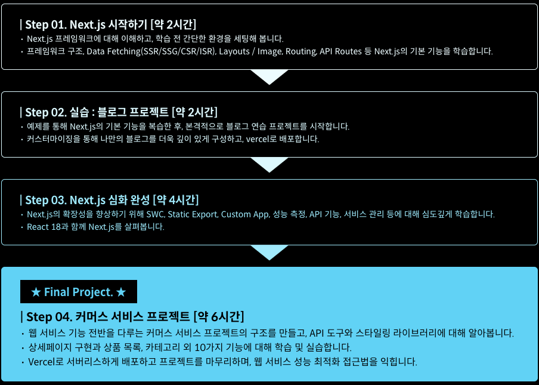

  
<h1 align="center">
  
Next.js 완전 정복

  
</h1>
  
  
<b>강의 분야: Next.js</b> 
강사 : 최지민(현 토스증권 Frontend Developer, Chapter Lead) 
[[강의 페이지](https://fastcampus.co.kr/dev_online_nextjs)] | [[깃허브](https://github.com/techoi/fastcampus-nextjs)]</b>

## :bulb: 목표

- **프론트엔드 API 구성 방법 공부**

  > Next.js의 API Routes 기능을 활용해서 API를 구성하는 방법을 공부한다.

- **Vercel을 활용한 배포 시스템 구성**

  > Next.js와 Vercel을 이용하여 빌드 + 호스팅 + 배포까지 수행해 본다.

- **커머스 서비스 프로젝트**

  > 커머스 서비스 페이지 구성 및 서버리스 배포까지 구성한다.

 

## :mag: 커리큘럼

 

## 🚩 학습 노트 목차

### Part1. 개념 소개

1.  Next.js 소개

    - Next.js 소개 및 도구 / 환경 설정

    - Next.js 로 만드는 사례 둘러보기(showcase / examples)

### Part2. Next.js 시작하기

1.  Next.js 기본 기능

    - 프레임워크 구조

    - Data Fetching

    - Layouts / Image

    - Routing

    - Shallow Routing

    - API Routes

### Part3. Practice : 블로그 프로젝트

1.  연습 프로젝트 실습(블로그 만들기)

    - 프로젝트 시작(Link Component / Client-Side Naivgation)

    - Layouts / Styling

    - Pre-rendering / Data Fetching

    - Dynamic Routes

    - API Routes / 배포하기(1)

    - API Routes / 배포하기(2)

2.  블로그 커스텀해보기

    - UI

    - 기능

### Part4. Next.js 심화

1.  Next.js 공식문서 뜯어보기

2.  심화 Step 1

    - Next.js Complier / Preview Mode

    - Static Export

    - Custom App / Document / Error Page

3.  심화 Step 2

    - Performance 측정

    - Error Handling

    - React 18과 함께 살펴보기

4.  심화 Step 3

    - Data Fetching API

    - router / link API

    - 기타 advanced

5.  심화 Step 4

    - configuration

    - 배포 관련 심화

### Part5. Final Project : 커머스 서비스 만들기

1.  환경 설정 및 프로젝트 생성

2.  실습 시작하기

    - Notion Public API 활용

    - PlanetScale & Prisma 활용

    - 스타일링 관련 라이브러리 살펴보기

    - TailwindCSS / Emotion

3.  커머스 기능 구현하기

4.  배포 및 마무리
